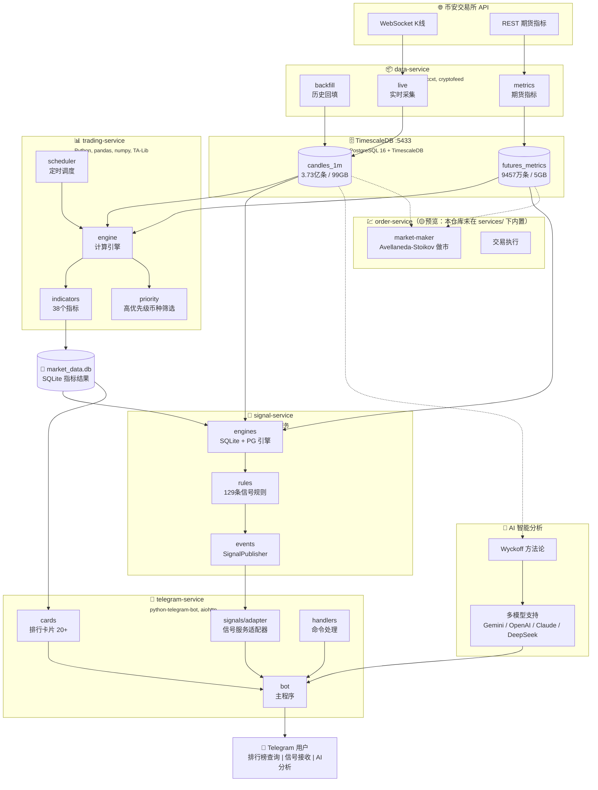
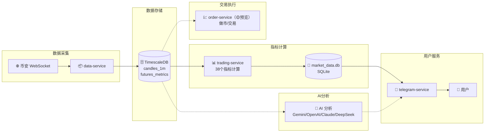

<p align="center">
  
</p>

<div align="center">

# 🐱 交易猫

本项目ai解读仓库（可能不完全准确）：https://zread.ai/tukuaiai/tradecat

感谢社区捐助的资金，让我去完成我的梦想！！！真心感谢你们！！！

**免责声明**

1. **开源与非官方声明**：本项目为永久开源项目，任何人可在开源许可范围内自由使用、分发与二次开发。本项目不隶属于任何交易所、基金、做市商或官方组织。
2. **非投资建议**：本项目及其相关内容仅用于技术研究与社区协作交流，不构成任何形式的投资建议、理财建议或交易建议。数字资产价格波动剧烈，存在归零风险，请自行评估风险并独立决策。
3. **代币无发行/无背书**：本项目不发行任何代币；任何以本项目名义发行、宣传、拉盘、募资、承诺收益的行为均与本项目无关。相关链上资产（如有）为第三方行为，风险自担。
4. **捐赠说明（唯一渠道）**：本项目目前接受且只接受来自 **SOL社区（代币地址，请勿直接转账，否则资产会丢失）(Gysp4iZ6uNuAksAPR37fQwLDRFU9Rz255UjExhiwpump)** 与 **BSC社区（代币地址，请勿直接转账，否则资产会丢失）(0x8a99b8d53eff6bc331af529af74ad267f3167777)** 两个社群的捐赠；捐赠属自愿行为，不提供任何回报或收益承诺。捐赠属自愿行为，不提供任何回报或收益承诺。
5. **公开地址与风险提示**：我的地址为公开明牌地址，请务必自行核对链、网络与地址，转账一经发生通常不可撤销，因误转/被骗/盗号/仿冒等导致的损失由转账方自行承担。
6. **责任限制**：在法律允许范围内，项目维护者/贡献者不对任何直接或间接损失承担责任，包括但不限于投资亏损、交易损失、合约风险、钓鱼诈骗、智能合约漏洞、第三方服务故障等。
7. **历史情况提示**：如涉及原dev或历史资金纠纷等问题，均为历史主体行为，本项目维护者不对第三方过往行为承担责任。

交易市场风云变幻，投资请谨慎，币不是我发的，明牌地址，亏钱请别骂我我害怕，我是玻璃心🙏🙏🙏，原dev已卷款跑路😅😅😅

我的加密货币钱包地址：

sol：`HjYhozVf9AQmfv7yv79xSNs6uaEU5oUk2USasYQfUYau`

bsc：`0xa396923a71ee7D9480b346a17dDeEb2c0C287BBC`,`0x60c062e7600f74079ea7b5e5568edfb9a3f61f0f`

**toy-level 数据分析/交易数据平台**

*全部市场，全部数据，全部方法，分析一切，交易一切，监控一切*

[English](README_EN.md) | 简体中文

[](https://github.com/tukuaiai/tradecat/stargazers)
[](https://github.com/tukuaiai/tradecat/network/members)
[](https://github.com/tukuaiai/tradecat/releases)
[](https://github.com/tukuaiai/tradecat/actions/workflows/ci.yml)
[](LICENSE)

---

<p>
  
  
  
  
  
  
  
  
  
  
  
  
  
  
  
  
  
  
</p>

<p>
  <a href="https://t.me/tradecat_ai_channel"></a>
  <a href="https://t.me/glue_coding"></a>
  <a href="https://x.com/123olp"></a>
</p>

</div>

---

## 📖 目录

- [💰 救救孩子](#-救救孩子)
- [🚀 快速开始](#-快速开始)
- [🏗️ 架构设计](#️-架构设计)
- [✨ 核心特性](#-核心特性)
- [📊 数据与功能](#-数据与功能)
- [📁 目录结构](#-目录结构)
- [🔧 运维指南](#-运维指南)
- [📞 联系方式](#-联系方式)

> 🤖 **从零开始？** 复制这行到 AI 助手：`按照 https://github.com/tukuaiai/tradecat/blob/main/README.md 的说明帮我安装 TradeCat`

---

<details open>
<summary><strong>点击展开👉 💰 救救孩子</strong></summary>

救救孩子，感谢了，好人一生平安🙏🙏🙏

- **币安 UID**: `572155580`
- **Tron (TRC20)**: `TQtBXCSTwLFHjBqTS4rNUp7ufiGx51BRey`
- **Solana**: `HjYhozVf9AQmfv7yv79xSNs6uaEU5oUk2USasYQfUYau`
- **Ethereum (ERC20)**: `0xa396923a71ee7D9480b346a17dDeEb2c0C287BBC`
- **BNB Smart Chain (BEP20)**: `0xa396923a71ee7D9480b346a17dDeEb2c0C287BBC`
- **Bitcoin**: `bc1plslluj3zq3snpnnczplu7ywf37h89dyudqua04pz4txwh8z5z5vsre7nlm`
- **Sui**: `0xb720c98a48c77f2d49d375932b2867e793029e6337f1562522640e4f84203d2e`

</details>

---

<details open>
<summary><strong>点击展开👉 🚀 快速开始</strong></summary>

### 🤖 AI 一键安装（推荐）

> 把下面的提示词复制到 **Claude / ChatGPT / Cursor / Kiro**，AI 会自动执行安装，零人工介入

**方式一：完整部署提示词（推荐）**

📄 **[README.md](README.md)** - 包含详细的 10 步部署流程，支持：
- 系统依赖自动安装
- 服务初始化和配置
- HuggingFace 历史数据自动下载导入
- 守护进程和日志轮转配置
- 完整的故障排查指南

复制该文件内容给 AI 助手即可自动完成全部部署。

<details>
<summary><strong>点击展开👉 📋 简化版安装提示词</strong></summary>

```
按照 https://github.com/tukuaiai/tradecat/blob/main/README.md 的说明帮我安装 TradeCat

要求：
1. 读取文档后直接执行安装命令，不要生成脚本
2. 一步一步执行，每步确认成功后继续
3. 遇到错误自动分析并修复
4. 安装完成后运行 ./scripts/verify.sh 验证
5. 全程零人工介入
```

</details>

### 🪟 Windows WSL2 用户

> 📺 **视频教程**: [WSL2 安装配置教程](https://www.bilibili.com/video/BV1n14y1x7Y7/)

先在 Windows 用户目录创建 `.wslconfig`：

```powershell
notepad "$env:USERPROFILE\.wslconfig"
```

写入：

```ini
[wsl2]
memory=10GB
processors=6
swap=12GB
networkingMode=mirrored
```

重启 WSL：`wsl --shutdown`，然后使用上面的 AI 安装提示词。

### ⚙️ 最短可跑通三步

```bash
# 0) 环境检查（可选，推荐部署前运行）
./scripts/check_env.sh

# 1) 初始化（创建各服务 .venv + 安装依赖）
./scripts/init.sh

# 2) 填写全局配置（含 BOT_TOKEN / DB / 代理 等）
cp config/.env.example config/.env && chmod 600 config/.env
# 端口：默认 LF=5433（K线/指标）、HF=15432（原子事实），见 config/.env.example
vim config/.env

# 3) 启动核心服务（ai + signal + telegram + trading）
./scripts/start.sh start
./scripts/start.sh status
```

> 说明：顶层 `./scripts/start.sh` 管理 `ai-service`、`signal-service`、`telegram-service`、`trading-service`（ai-service 为子模块，仅做就绪检查，无独立进程）。  
> 低频/分时采集服务 data-service：`services/ingestion/data-service/`（兼容链路，不在默认启动链路）。  
> 可选服务需手动启动：  
> - `cd services/consumption/api-service && ./scripts/start.sh start`（REST API，默认端口 8088）  
> - `cd services/consumption/sheets-service && ./scripts/start.sh start`（Google Sheets 公共看板同步，默认 daemon）

### ⚙️ 配置（必须）

- 路径：`config/.env`（需手动从 `.env.example` 复制；或运行 `./scripts/install.sh` 自动生成），权限需 600，服务启动脚本会强制校验。  
- **TimescaleDB 端口说明**（重要，按仓库现状）：
  - LF（低频/分时/K线与指标）：`DATABASE_URL` 默认 `localhost:5433/market_data`（见 `config/.env.example`）
  - HF（高频/原子事实）：`BINANCE_VISION_DATABASE_URL` 默认 `localhost:15432/market_data`（见 `config/.env.example`）
  - 若你在私有环境使用其它端口（例如历史文档曾提及 5434）：请全局统一端口与脚本/命令；仓库当前示例以 5433/15432 为准。<!-- TODO: 若仓库正式迁移到其它端口，请补“统一替换列表与执行顺序” -->
- 核心字段：  
  - `DATABASE_URL`（TimescaleDB，见下方端口说明）  
  - `BOT_TOKEN`（Telegram Bot Token）  
  - `TELEGRAM_GROUP_WHITELIST`（群聊白名单，逗号分隔；为空仅私聊；群聊仅响应 `/` 或 `!` 开头且需 @bot）  
  - `HTTP_PROXY` / `HTTPS_PROXY`（需要代理时填写）  
  - 外部地址：`BINANCE_WEB_BASE`、`BINANCE_PING_URL`、`SYMBOLS_ALL_URL`、`TELEGRAM_API_BASE`、`POLYMARKET_WEB_BASE`、`KALSHI_WEB_BASE`、`OPINION_WEB_BASE`、`NODEJS_SETUP_URL`、`NOFX_*`
  - 币种/周期：`SYMBOLS_GROUPS`、`SYMBOLS_EXTRA`、`SYMBOLS_EXCLUDE`、`INTERVALS`、`KLINE_INTERVALS`、`FUTURES_INTERVALS`  
  - 采集/计算开关：`BACKFILL_MODE`/`BACKFILL_DAYS`/`BACKFILL_ON_START`、`MAX_CONCURRENT`、`RATE_LIMIT_PER_MINUTE`  
  - 默认值：`BACKFILL_MODE=all`（全量回填，若设置 `BACKFILL_START_DATE` 则按起始日计算天数；否则约 10 年）、`SYMBOLS_GROUPS=main4`（只拉 BTC/ETH/SOL/BNB，如需全市场改为 `all` 或自定义分组）  
  - 计算后端：`COMPUTE_BACKEND`、`MAX_WORKERS`、`HIGH_PRIORITY_TOP_N`、`INDICATORS_ENABLED`/`INDICATORS_DISABLED`  
  - 展示过滤：`BINANCE_API_DISABLED`、`DISABLE_SINGLE_TOKEN_QUERY`、`SNAPSHOT_HIDDEN_FIELDS`、`BLOCKED_SYMBOLS`  
  - AI/交易：`AI_INDICATOR_TABLES`、`AI_INDICATOR_TABLES_DISABLED`、`LLM_BACKEND`、`LLM_API_BASE_URL`、`EXTERNAL_API_KEY`、`LLM_MODEL`、`LLM_MAX_TOKENS`、`AI_LARGE_PAYLOAD_CHAR_LIMIT`、`AI_FORCE_GEMINI_ON_LARGE_PAYLOAD`、`AI_DEFAULT_PROMPT`、`AI_RECORD_ENABLED`、`AI_RECORD_PAYLOAD`、`AI_RECORD_PROMPT`、`AI_RECORD_MESSAGES`、`AI_RECORD_ANALYSIS`、`AI_RECORD_MAX_DIRS`、`BINANCE_API_KEY`、`BINANCE_API_SECRET`
  - 国际化：`DEFAULT_LOCALE`（默认 en）、`SUPPORTED_LOCALES`（zh-CN,en）、`FALLBACK_LOCALE`
  - Google Sheets（可选，`sheets-service`）：`SHEETS_*` 见 `config/.env.example` 的 “Google Sheets 公共看板” 段落；弱网/代理环境可用 `SHEETS_SA_NET_WRITE_RETRIES` 提升 SA 模式稳定性（默认 2）。

### 📦 下载历史数据（可选）

从 HuggingFace 下载预置数据集，跳过漫长的历史回填：

🔗 **数据集**: [huggingface.co/datasets/123olp/binance-futures-ohlcv-2018-2026](https://huggingface.co/datasets/123olp/binance-futures-ohlcv-2018-2026)

**方式一：使用自动下载脚本（推荐）**

> **默认下载 Main4 精简数据集**（415MB，4币种，1150万条记录，2020-2026完整历史）

```bash
# 安装依赖
services/ingestion/data-service/.venv/bin/python -m pip install pandas psycopg2-binary huggingface_hub

# 默认下载 Main4 数据集（BTC/ETH/BNB/SOL，415MB）
services/ingestion/data-service/.venv/bin/python scripts/download_hf_data.py

# 或指定币种
services/ingestion/data-service/.venv/bin/python scripts/download_hf_data.py --symbols BTCUSDT,ETHUSDT,BNBUSDT
```

脚本特性：
- **默认下载 Main4 精简数据集**（415MB），不是完整版（13GB）
- 流式读取，内存友好
- 支持断点续传（已下载的文件会跳过）

**方式二：手动导入（完整数据）**

```bash
# 0. 创建库并导入 schema（依次执行仓库内 SQL）
for f in libs/database/db/schema/*.sql; do
  psql -h localhost -p 5433 -U postgres -d market_data -f "$f"
done

# 1. 导入 K线数据 (3.73亿条)
zstd -d candles_1m.bin.zst -c | psql -h localhost -p 5433 -U postgres -d market_data \
  -c "COPY market_data.candles_1m FROM STDIN WITH (FORMAT binary)"

# 2. 导入期货数据 (9457万条)
zstd -d futures_metrics_5m.bin.zst -c | psql -h localhost -p 5433 -U postgres -d market_data \
  -c "COPY market_data.binance_futures_metrics_5m FROM STDIN WITH (FORMAT binary)"
```

> 端口说明：本文与仓库脚本示例按 `config/.env.example` 默认端口（LF=5433，HF=15432）编写；如你改动端口，请同步所有示例命令与脚本配置。

## 🔍 补充检查（2026-01-23）

- **端口选择**：`config/.env.example` 默认 LF=5433、HF=15432；仓库脚本示例亦以此为准。若你自行改动端口，请全局统一。
- CI 仅执行 ruff + py_compile 抽样（`.github/workflows/ci.yml`，检查前 50 个 .py 文件），不会跑 tests；提交前本地仍需 `./scripts/verify.sh`。
- `scripts/install.sh` 会创建 `config/.env`（若不存在）；运行时统一只读 `config/.env`，避免多份配置漂移。

### ✅ 验证安装

```bash
./scripts/verify.sh
```

---

<details>
<summary><strong>点击展开👉 📖 手动安装步骤</strong></summary>

### 环境要求

| 依赖 | 版本 | 说明 |
|:---|:---|:---|
| Python | 3.12+ | CI 使用 3.12；各服务 `services/*/*/pyproject.toml` 声明 `requires-python >=3.12`（`scripts/init.sh` 的最低检查为 3.10） |
| PostgreSQL | 16+ | 需安装 TimescaleDB 扩展 |
| TA-Lib | 0.4+ | 系统级库，需单独安装 |
| SQLite | 3.x | 系统自带 |

### 安装步骤

#### 1. 克隆仓库

```bash
git clone https://github.com/tukuaiai/tradecat.git
cd tradecat
```

#### 2. 安装系统依赖

```bash
# Ubuntu/Debian
sudo apt-get update
sudo apt-get install -y build-essential python3-dev

# 安装 TA-Lib
wget http://prdownloads.sourceforge.net/ta-lib/ta-lib-0.4.0-src.tar.gz
tar -xzf ta-lib-0.4.0-src.tar.gz
cd ta-lib && ./configure --prefix=/usr && make && sudo make install
cd .. && rm -rf ta-lib ta-lib-0.4.0-src.tar.gz
```

#### 3. 一键初始化

```bash
# 初始化所有服务（创建虚拟环境、安装依赖、复制配置）
./scripts/init.sh

# 或单独初始化某个服务
./scripts/init.sh binance-vision-service
```

#### 4. 配置环境变量

```bash
# 编辑 `config/.env`（如不存在：cp config/.env.example config/.env && chmod 600 config/.env）
vim config/.env
```

关键配置补充（信号服务）：
- `SIGNAL_DATA_MAX_AGE`：信号数据最大允许时长（秒），超过则跳过不产生信号；默认 600，可按部署环境调整。
- `COOLDOWN_SECONDS`（signal-service）：PG 信号冷却时间（秒），可与规则级冷却配合，避免重复推送。

关键配置补充（nofx-dev，预览服务）：
- `NOFX_*`：nofx-dev 上游地址/鉴权等（见 `config/.env.example` 的 NOFX 段落；nofx-dev 本身也有独立文档）。

#### 5. 启动服务

```bash
# 启动所有服务
./scripts/start.sh start

# 查看状态
./scripts/start.sh status

# 停止全部
./scripts/start.sh stop
```

#### 6. 验证安装

```bash
./scripts/verify.sh
```

</details>

</details>

---

<details>
<summary><strong>点击展开👉 ✨ 核心特性</strong></summary>

<table>
<tr>
<td width="50%">

### 🔄 多市场数据采集（🟡预览/规划中）
- 说明：当前仓库核心链路聚焦加密货币；A股/美股/宏观/OpenBB 等属于 markets-service 预览方向（本仓库 `services/` 下未内置实现，仅保留配置/文档占位）。
- **加密货币** - CCXT (100+交易所) + Cryptofeed (WebSocket)
- **A股市场** - AKShare + BaoStock (免费全量)
- **美股/全球** - yfinance + pandas-datareader
- **宏观经济** - FRED API (美联储官方)
- **数据聚合** - OpenBB (100+数据源)

</td>
<td width="50%">

### 📊 38个技术指标模块
- **趋势指标** - EMA/MACD/SuperTrend/趋势云/趋势线/ADX/Ichimoku
- **动量指标** - RSI/KDJ/MFI/多空比/斐波那契狙击/CCI/WilliamsR
- **波动指标** - 布林带/ATR/支撑阻力/VWAP/Donchian/Keltner
- **形态识别** - TA-Lib 61种蜡烛 + 价格形态

</td>
</tr>
<tr>
<td width="50%">

### 🤖 Telegram Bot
- **实时排行榜** - 20+ 种排行卡片
- **信号推送** - 形态突破、指标异常
- **交互查询** - 单币详情、多周期面板
- **AI 分析** - Wyckoff 深度市场分析

</td>
<td width="50%">

### 🗄️ 海量数据存储
- **K线数据** - 3.73亿条 (2018-至今)
- **期货数据** - 9457万条 (2021-至今)
- **存储引擎** - TimescaleDB 时序优化
- **衍生品定价** - QuantLib 期权/债券

</td>
</tr>
<tr>
<td width="50%">

### 🧠 AI 智能分析
- **Wyckoff 方法论** - 市场结构、供需区间、阶段判断
- **多模型支持** - Gemini / OpenAI / Claude / DeepSeek
- **专业提示词** - 内置交易分析师角色 Prompt
- **上下文增强** - 自动注入实时 K线/指标/期货数据

</td>
<td width="50%">

### 🔔 信号检测引擎
- **129条规则** - 覆盖8个分类（独立 signal-service）
- **多维度检测** - 趋势/动量/形态/期货
- **事件驱动** - SignalPublisher 发布信号事件
- **订阅管理** - 用户自定义推送偏好
- **冷却机制** - 防止重复推送

</td>
</tr>
</table>

</details>

---

<details open>
<summary><strong>点击展开👉 🏗️ 架构设计</strong></summary>

### 系统架构图



### 服务说明

| 服务 | 端口 | 职责 | 技术栈 |
|:---|:---:|:---|:---|
| **data-service** | - | 加密货币 K线采集、期货指标采集、历史数据回填 | Python, asyncio, ccxt, cryptofeed |
| **trading-service** | - | 38个技术指标模块计算、高优先级币种筛选、定时调度 | Python, pandas, numpy, TA-Lib |
| **signal-service** | - | 独立信号检测服务（129条规则、8分类、事件发布） | Python, SQLite, psycopg2 |
| **telegram-service** | - | Bot 交互、排行榜展示、信号推送 UI（通过 adapter 调用 signal-service） | python-telegram-bot, aiohttp |
| **ai-service** | - | AI 分析、Wyckoff 方法论（作为 telegram-service 子模块） | Gemini/OpenAI/Claude/DeepSeek |
| **fate-service** | - | 命理/排盘服务（独立微服务） | Python, Node.js（可选） |
| **api-service** | 8088 | REST API 服务（指标/K线/信号数据查询；可用 `API_SERVICE_PORT` 覆盖） | FastAPI, Pydantic |
| **sheets-service** | - | Google Sheets 公共看板同步（TG 卡片→表格；可审计/可重放） | python-dotenv, python-telegram-bot |
| **vis-service** | 8087 | 可视化渲染（K线图/指标图/VPVR） | FastAPI, matplotlib, mplfinance |
| **predict-service** | - | 预测市场信号（Polymarket/Kalshi/Opinion） | Node.js + Python utilities |
| **nofx-dev** | - | Agentic Trading OS（预览/外部工程镜像，非核心链路） | Go, React, TypeScript |
| **markets-service（🟡预览：仅保留配置与文档，未在 services/ 下内置）** | - | 全市场数据采集（美股/A股/宏观/衍生品定价） | yfinance, akshare, fredapi, QuantLib |
| **order-service（🟡预览：仅保留配置与文档，未在 services/ 下内置）** | - | 交易执行、Avellaneda-Stoikov 做市 | Python, ccxt, cryptofeed |
| **TimescaleDB（LF）** | 5433 | 低频/分时/K线与指标（`DATABASE_URL`） | PostgreSQL 16 + TimescaleDB |
| **TimescaleDB（HF）** | 15432 | 高频/原子事实（`BINANCE_VISION_DATABASE_URL`） | PostgreSQL 16 + TimescaleDB |

### 数据流向



</details>

---

<details>
<summary><strong>点击展开👉 📊 数据与功能</strong></summary>

### 📊 数据规模

**🔗 历史数据下载**: [HuggingFace 数据集](https://huggingface.co/datasets/123olp/binance-futures-ohlcv-2018-2026)

| 数据集 | 说明 | 大小 |
|:---|:---|:---|
| `candles_1m.bin.zst` | K线数据 (2018-至今, 3.73亿条) | ~15 GB |
| `futures_metrics_5m.bin.zst` | 期货指标 (2021-至今, 9457万条) | ~800 MB |

<details>
<summary><strong>点击展开👉 📋 数据详情与导入步骤</strong></summary>

### 数据概览

<table>
<tr>
<td width="50%">

#### 📈 K线数据 (candles_1m)

| 指标 | 数值 |
|:---|---:|
| **总记录数** | 373,342,599 |
| **币种数量** | 615 |
| **时间范围** | 2018-01-01 ~ 至今 |
| **存储大小** | 99 GB |
| **压缩后** | ~15 GB (zstd) |

**字段说明**:
- `bucket_ts` - K线时间戳
- `open/high/low/close` - OHLC 价格
- `volume` - 成交量
- `quote_volume` - 成交额 (USDT)
- `taker_buy_volume` - 主动买入量

</td>
<td width="50%">

#### 📊 期货数据 (futures_metrics_5m)

| 指标 | 数值 |
|:---|---:|
| **总记录数** | 94,576,458 |
| **币种数量** | 612 |
| **时间范围** | 2021-12-01 ~ 至今 |
| **存储大小** | 5 GB |
| **压缩后** | ~800 MB (zstd) |

**字段说明**:
- `sum_open_interest` - 持仓量
- `sum_open_interest_value` - 持仓价值 (USDT)
- `sum_toptrader_long_short_ratio` - 大户多空比
- `sum_taker_long_short_vol_ratio` - 主动买卖比

</td>
</tr>
</table>

### 数据更新频率

| 数据类型 | 更新频率 | 延迟 |
|:---|:---|:---|
| K线 (1m) | 实时 WebSocket | < 5秒 |
| K线 (5m/15m/1h/4h/1d/1w) | 聚合计算 | < 10秒 |
| 期货指标 | 每 5 分钟 | < 30秒 |
| 技术指标 | 每分钟轮询 | < 3分钟 |

### 导入步骤

```bash
# 1. 下载数据文件
# 从 HuggingFace 下载 .bin.zst 文件到 backups/timescaledb/

# 2. 恢复表结构（兼容 schema.sql.zst / schema_*.sql.zst）
zstd -d schema*.sql.zst -c | psql -h localhost -p 5433 -U postgres -d market_data

# 3. 导入 K线数据
zstd -d candles_1m.bin.zst -c | psql -h localhost -p 5433 -U postgres -d market_data \
    -c "COPY market_data.candles_1m FROM STDIN WITH (FORMAT binary)"

# 4. 导入期货数据
zstd -d futures_metrics_5m.bin.zst -c | psql -h localhost -p 5433 -U postgres -d market_data \
    -c "COPY market_data.binance_futures_metrics_5m FROM STDIN WITH (FORMAT binary)"
```

> 💡 导入后即可使用 trading-service 计算指标，无需从头采集历史数据。

</details>

### 📈 技术指标 (38个模块)

<details>
<summary><strong>点击展开👉 🔥 趋势指标 (8个)</strong></summary>

| 指标 | 说明 | 参数 |
|:---|:---|:---|
| **EMA** | 指数移动平均 | 7/25/99 周期 |
| **MACD** | 异同移动平均 | 12/26/9 |
| **SuperTrend** | 超级趋势 | ATR 周期 10, 乘数 3 |
| **ADX** | 平均趋向指数 | 14 周期 |
| **Ichimoku** | 一目均衡表 | 9/26/52 |
| **Donchian** | 唐奇安通道 | 20 周期 |
| **Keltner** | 肯特纳通道 | 20 周期, ATR 2倍 |
| **趋势线** | 自动趋势线识别 | 动态计算 |

</details>

<details>
<summary><strong>点击展开👉 📊 动量指标 (6个)</strong></summary>

| 指标 | 说明 | 参数 |
|:---|:---|:---|
| **RSI** | 相对强弱指数 | 14 周期 |
| **KDJ** | 随机指标 | 9/3/3 |
| **CCI** | 商品通道指数 | 20 周期 |
| **WilliamsR** | 威廉指标 | 14 周期 |
| **MFI** | 资金流量指数 | 14 周期 |
| **RSI谐波** | RSI 背离检测 | 14 周期 |

</details>

<details>
<summary><strong>点击展开👉 📉 波动指标 (4个)</strong></summary>

| 指标 | 说明 | 参数 |
|:---|:---|:---|
| **布林带** | Bollinger Bands | 20 周期, 2倍标准差 |
| **ATR** | 真实波幅 | 14 周期 |
| **ATR波幅** | 波动率排行 | 14 周期 |
| **支撑阻力** | 关键价位识别 | 动态计算 |

</details>

<details>
<summary><strong>点击展开👉 📦 成交量指标 (6个)</strong></summary>

| 指标 | 说明 | 用途 |
|:---|:---|:---|
| **OBV** | 能量潮 | 量价背离 |
| **CVD** | 累积成交量差 | 买卖力量 |
| **VWAP** | 成交量加权均价 | 机构成本 |
| **成交量比率** | 相对成交量 | 放量识别 |
| **流动性** | 买卖盘深度 | 滑点预估 |
| **VPVR** | 成交量分布 | 密集成交区 |

</details>

<details>
<summary><strong>点击展开👉 🕯️ K线形态 (61+种)</strong></summary>

**蜡烛形态 (TA-Lib, 61种)**

| 类型 | 形态 |
|:---|:---|
| **反转形态** | 锤子线、上吊线、吞没、孕线、晨星、黄昏星、三只乌鸦 |
| **持续形态** | 三法、分离线、并列阴阳 |
| **中性形态** | 十字星、纺锤线、高浪线 |

**价格形态 (patternpy)**

| 类型 | 形态 | 信号 |
|:---|:---|:---|
| **头肩形态** | 头肩顶、头肩底 | 强反转 |
| **双重形态** | 双顶、双底 | 中等反转 |
| **三角形态** | 上升三角、下降三角、对称三角 | 突破方向 |
| **楔形形态** | 上升楔形、下降楔形 | 反向突破 |
| **通道形态** | 上升通道、下降通道、水平通道 | 趋势延续 |

</details>

<details>
<summary><strong>点击展开👉 📡 期货指标 (8个)</strong></summary>

| 指标 | 说明 | 信号含义 |
|:---|:---|:---|
| **持仓量** | Open Interest | 市场参与度 |
| **持仓价值** | OI Value (USDT) | 资金规模 |
| **多空比** | Long/Short Ratio | 散户情绪 |
| **大户多空比** | Top Trader L/S | 主力方向 |
| **主动买卖比** | Taker Buy/Sell | 即时情绪 |
| **资金费率** | Funding Rate | 多空成本 |
| **爆仓数据** | Liquidations | 极端行情 |
| **期货情绪聚合** | 综合评分 | 多维度分析 |

</details>

### 高优先级算法

系统自动识别高优先级币种 (约 130-150 个)，基于以下维度：

```
高优先级 = K线维度 ∪ 期货维度

K线维度:
  - 成交额 Top 50
  - 波动率 Top 30  
  - 涨跌幅 Top 30

期货维度:
  - 持仓价值 Top 30
  - 主动买卖比极端 (>1.5 或 <0.67)
  - 多空比极端 (>2.0 或 <0.5)
```

### 🤖 Telegram Bot

#### 功能概览

<table>
<tr>
<td width="50%">

##### 📊 排行榜卡片 (20+种)

| 类别 | 卡片 |
|:---|:---|
| **基础排行** | RSI、MACD、KDJ、布林带、OBV |
| **高级排行** | EMA、ATR、CVD、MFI、VWAP、流动性 |
| **形态排行** | K线形态、支撑阻力、趋势线 |
| **期货排行** | 持仓量、多空比、主动买卖比 |

</td>
<td width="50%">

#### 🔔 信号推送

| 信号类型 | 触发条件 |
|:---|:---|
| **形态突破** | 检测到头肩、双顶等形态 |
| **指标异常** | RSI 超买超卖、MACD 金叉死叉 |
| **量价异动** | 成交量突增、价格突破 |
| **期货异常** | 多空比极端、持仓量剧变 |

</td>
</tr>
</table>

### 命令与触发方式

| 触发方式 | 功能 | 说明 |
|:---|:---|:---|
| `BTC!` | 单币查询 | 交互式多面板查看 |
| `BTC!!` | 完整TXT导出 | 下载 psql 风格完整报告 |
| `BTC@` | AI分析 | 威科夫深度市场分析 |
| `/data` | 数据面板 | 访问排行榜卡片 |
| `/ai` | AI分析 | 进入AI币种选择 |
| `/query` | 币种查询 | 显示可查询币种 |
| `/help` | 帮助 | 使用说明 |

</details>

---

<details>
<summary><strong>点击展开👉 📁 目录结构</strong></summary>

```
tradecat/
│
├── 📂 assets/                      # 规范化资源根（真实目录；建议以此为准）
│   ├── 📂 common/                  # 共享工具库（等价 libs/common）
│   ├── 📂 database/                # DDL/CSV/SQLite（等价 libs/database；*.db 默认忽略）
│   ├── 📂 config/                  # 全局配置（等价 config；.env 不提交）
│   ├── 📂 docs/                    # 项目文档（等价 docs）
│   ├── 📂 tasks/                   # 任务文档（等价 tasks）
│   └── 📂 artifacts/               # 构建/分析产物（等价 artifacts；默认忽略）
│
├── 📎 libs -> assets               # 兼容旧路径（symlink）：libs/common、libs/database
├── 📎 config -> assets/config      # 兼容路径（symlink）：config/.env.example → config/.env（不提交）
├── 📎 docs -> assets/docs          # 兼容路径（symlink）
├── 📎 tasks -> assets/tasks        # 兼容路径（symlink）
├── 📎 artifacts -> assets/artifacts# 兼容路径（symlink）
│
├── 📂 scripts/                     # 全局脚本（install/init/start/verify/check_env/导出/压缩等）
│
├── 📂 services/                    # 服务分层（采集/计算/消费）
│   ├── 📂 ingestion/               # 采集层：写 TimescaleDB
│   │   ├── 📂 data-service/        # 低频/分时采集（兼容链路，非默认启用）
│   │   ├── 📂 binance-vision-service/  # Binance Vision Raw 对齐采集（高频原子事实）
│   │   └── 📂 predict-service/     # 预测市场信号（Polymarket/Kalshi/Opinion）
│   │
│   ├── 📂 compute/                 # 计算层：读 PG / 写 SQLite
│   │   ├── 📂 trading-service/     # 指标计算（写入 SQLite，供展示层消费）
│   │   ├── 📂 signal-service/      # 信号检测（规则引擎）
│   │   ├── 📂 ai-service/          # AI 分析（telegram 子模块）
│   │   └── 📂 fate-service/        # 命理/排盘（独立微服务）
│   │
│   └── 📂 consumption/             # 消费层：对外呈现（Telegram/API/Sheets/可视化）
│       ├── 📂 telegram-service/    # Telegram Bot（卡片/订阅/快照）
│       ├── 📂 api-service/         # REST API（可选）
│       ├── 📂 sheets-service/      # Google Sheets 公共看板同步（可选）
│       ├── 📂 vis-service/         # 可视化渲染（可选）
│       └── 📂 nofx-dev/            # 预览：外部工程镜像（非核心链路）
│
├── 📂 .github/                     # 社区与安全规范（CI/贡献指南/安全策略）
│
├── 📄 mkdocs.yml                   # 文档站配置（assets/docs/ 为入口；docs/ 为 symlink 兼容层）
├── 📄 pyproject.toml               # 根级工具配置（ruff/pytest 等）
├── 📄 Makefile                     # 常用命令聚合
├── 📄 README.md                    # 项目说明（本文件）
├── 📄 README_EN.md                 # 英文说明
├── 📄 AGENTS.md                    # AI Agent 操作手册
├── 📄 CONSTITUTION.md              # 架构宪法/硬约束
└── 📄 .python-version              # Python 版本锁定

# 运行时生成（首次执行 ./scripts/init.sh 或 ./scripts/start.sh 后出现；不随仓库提交）
# - logs/  run/  backups/  （以及各服务内的 logs/ pids/ data/cache 等）
```

</details>

---

<details>
<summary><strong>点击展开👉 🔧 运维指南</strong></summary>

### 服务管理

<details>
<summary><strong>点击展开👉 统一管理（推荐）</strong></summary>

```bash
# 启动所有服务
./scripts/start.sh start

# 查看状态
./scripts/start.sh status

# 停止全部
./scripts/start.sh stop

# 重启
./scripts/start.sh restart
```

</details>

<details>
<summary><strong>点击展开👉 单服务管理</strong></summary>

```bash
# data-service（低频/分时兼容链路，支持守护模式）
cd services/ingestion/data-service
./scripts/start.sh start    # 启动（含守护）
./scripts/start.sh stop     # 停止
./scripts/start.sh status   # 状态
# ws 自愈：当 DB 长时间不再写入 1m K 线时，守护会自动重启 ws（可通过 DATA_SERVICE_WS_DB_* 配置）

# trading-service / telegram-service
cd services/compute/trading-service  # 或 services/consumption/telegram-service
./scripts/start.sh start    # 启动
./scripts/start.sh stop     # 停止
./scripts/start.sh status   # 状态

# api-service（可选）
cd services/consumption/api-service
./scripts/start.sh start
./scripts/start.sh status
```

</details>

<details>
<summary><strong>点击展开👉 初始化</strong></summary>

```bash
# 初始化全部服务
./scripts/init.sh

# 初始化单个服务
./scripts/init.sh binance-vision-service
```

</details>

<details>
<summary><strong>点击展开👉 验证与检查</strong></summary>

```bash
./scripts/verify.sh
```

</details>

<details>
<summary><strong>点击展开👉 查看日志</strong></summary>

```bash
# data-service 日志
tail -f services/ingestion/data-service/logs/backfill.log
tail -f services/ingestion/data-service/logs/metrics.log
tail -f services/ingestion/data-service/logs/ws.log

# trading-service 日志
tail -f services/compute/trading-service/logs/service.log

# telegram-service 日志
tail -f services/consumption/telegram-service/logs/bot.log

# signal-service 日志
tail -f services/compute/signal-service/logs/signal-service.log

# 守护进程日志
tail -f logs/daemon.log
```

</details>

<details>
<summary><strong>点击展开👉 进程监控</strong></summary>

```bash
# 查看所有相关进程
ps aux | grep -E "data-service|trading-service|telegram|signal-service|src\\.simple_scheduler|main\\.py"

# 查看资源占用
htop -p $(pgrep -d',' -f "src\\.simple_scheduler|src\\.kline_listener|telegram-service|signal-service|uvicorn")
```

</details>

### 数据库操作

<details>
<summary><strong>点击展开👉 TimescaleDB 查询</strong></summary>

```bash
# 连接数据库
PGPASSWORD=postgres psql -h localhost -p 5433 -U postgres -d market_data

# 常用查询
-- K线数据量
SELECT COUNT(*) FROM market_data.candles_1m;

-- 最新数据时间
SELECT MAX(bucket_ts) FROM market_data.candles_1m;

-- 币种列表
SELECT DISTINCT symbol FROM market_data.candles_1m ORDER BY symbol;

-- 单币种数据
SELECT * FROM market_data.candles_1m 
WHERE symbol = 'BTCUSDT' 
ORDER BY bucket_ts DESC LIMIT 10;
```

</details>

<details>
<summary><strong>点击展开👉 SQLite 查询</strong></summary>

```bash
# 连接数据库
# 说明：`market_data.db` 由 `services/compute/trading-service` 运行后生成（`*.db` 默认在 `.gitignore` 中忽略，不随仓库提交）
sqlite3 libs/database/services/telegram-service/market_data.db

# 常用查询
.tables                          -- 查看所有表
.schema "K线形态扫描器.py"        -- 查看表结构

-- 查看形态数据
SELECT * FROM "K线形态扫描器.py" 
WHERE 形态类型 LIKE '%头肩%' 
LIMIT 10;
```

</details>

### 数据备份

<details>
<summary><strong>点击展开👉 导出 TimescaleDB</strong></summary>

```bash
# 运行导出脚本 (后台执行)
nohup ./scripts/export_timescaledb.sh &

# 查看进度
tail -f backups/timescaledb/export.log
ls -lh backups/timescaledb/

# 输出文件:
# - candles_1m_*.bin.zst      (~15GB, K线数据)
# - futures_metrics_*.bin.zst (~800MB, 期货数据)
# - schema_*.sql.zst          (表结构)
# - restore_*.sh              (恢复脚本)
```

</details>

<details>
<summary><strong>点击展开👉 恢复数据</strong></summary>

```bash
cd backups/timescaledb

# 恢复 schema
zstd -d schema_*.sql.zst -c | psql -h localhost -p 5433 -U postgres -d market_data

# 恢复 K线数据
zstd -d candles_1m_*.bin.zst -c | psql -h localhost -p 5433 -U postgres -d market_data \
    -c "COPY market_data.candles_1m FROM STDIN WITH (FORMAT binary)"

# 恢复期货数据
zstd -d futures_metrics_*.bin.zst -c | psql -h localhost -p 5433 -U postgres -d market_data \
    -c "COPY market_data.binance_futures_metrics_5m FROM STDIN WITH (FORMAT binary)"
```

</details>

### 常见问题

<details>
<summary><strong>点击展开👉 Q: TA-Lib 安装失败？</strong></summary>

```bash
# 确保先安装系统库
sudo apt-get install -y build-essential

# 下载并编译 TA-Lib
wget http://prdownloads.sourceforge.net/ta-lib/ta-lib-0.4.0-src.tar.gz
tar -xzf ta-lib-0.4.0-src.tar.gz
cd ta-lib
./configure --prefix=/usr
make
sudo make install

# 然后安装 Python 包
pip install TA-Lib
```

</details>

<details>
<summary><strong>点击展开👉 Q: K线形态显示"无形态"？</strong></summary>

```bash
# 检查 TA-Lib 是否安装
python -c "import talib; print(talib.__version__)"

# 检查形态库是否安装
pip install m-patternpy
pip install tradingpattern --no-deps

# 重启 trading-service
cd services/compute/trading-service
./scripts/start.sh restart
```

</details>

<details>
<summary><strong>点击展开👉 Q: 数据库连接失败？</strong></summary>

```bash
# 检查 PostgreSQL 是否运行
sudo systemctl status postgresql

# 检查端口
ss -tlnp | grep 5433

# 检查连接
PGPASSWORD=postgres psql -h localhost -p 5433 -U postgres -c "\l"
```

</details>

</details>

---

<details open>
<summary><strong>点击展开👉 📞 联系方式</strong></summary>

- **Telegram 频道**: [tradecat_ai_channel](https://t.me/tradecat_ai_channel)
- **Telegram 交流群**: [glue_coding](https://t.me/glue_coding)
- **Twitter/X**: [123olp](https://x.com/123olp)
- **discord**:  [tradecat](https://discord.gg/nppHyjrfqX)

</details>

---

## 📜 许可证

本项目采用 [MIT License](LICENSE) 开源许可证。

---

## Star History

<a href="https://www.star-history.com/#tukuaiai/tradecat&type=date&legend=top-left">
 <picture>
   <source media="(prefers-color-scheme: dark)" srcset="https://api.star-history.com/svg?repos=tukuaiai/tradecat&type=date&theme=dark&legend=top-left" />
   <source media="(prefers-color-scheme: light)" srcset="https://api.star-history.com/svg?repos=tukuaiai/tradecat&type=date&legend=top-left" />
   
 </picture>
</a>

---

<div align="center">

### ⭐ 如果这个项目对您有帮助，请点亮 Star！

---

**Made with ❤️ by [tukuaiai](https://github.com/tukuaiai)**

[⬆ 返回顶部](#-tradecat)

</div>
