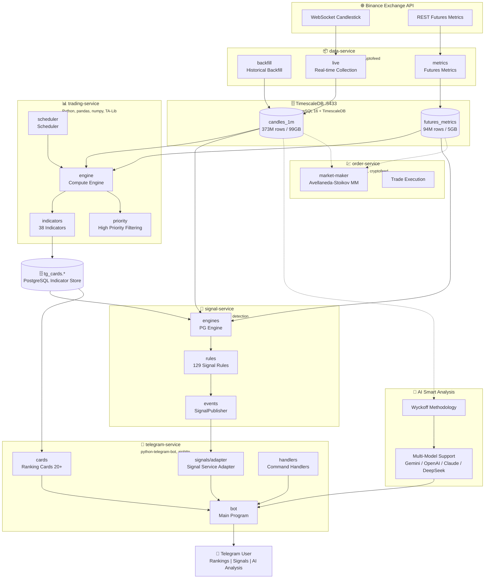
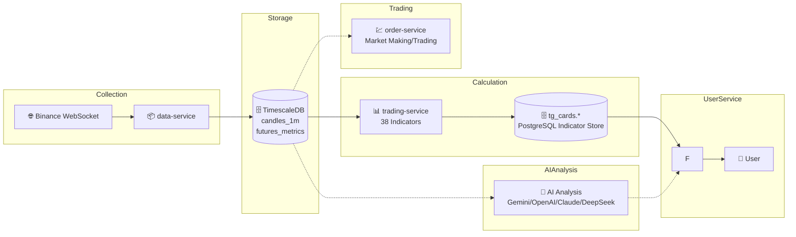

<p align="center">
  
</p>

<div align="center">

# 🐱 TradeCat

This project's AI repository (may not be entirely accurate): https://zread.ai/tukuaiai/tradecat

Community-funded open-source project. Thanks for the support!  
Donations (optional):
<p>
Solana(For CA tokens, please do not transfer directly; otherwise, your assets will be lost.)
: Gysp4iZ6uNuAksAPR37fQwLDRFU9Rz255UjExhiwpump
</p>

<p>
BSC (BEP20)(For CA tokens, please do not transfer directly; otherwise, your assets will be lost.)
: 0x8a99b8d53eff6bc331af529af74ad267f3167777
</p>

**Disclaimer**

1. **Open-source & non-official statement**: This project is permanently open-source. Anyone may use, distribute, and develop derivatives within the scope of the open-source license. This project is not affiliated with any exchange, fund, market maker, or official organization.

2. **Not investment advice**: This project and its related content are provided solely for technical research and community collaboration/communication. They do not constitute investment advice, financial advice, or trading advice of any kind. Digital asset prices are highly volatile and may fall to zero; please assess risks independently and make your own decisions.

3. **No token issuance / no endorsement**: This project does not issue any tokens. Any issuance, promotion, price manipulation, fundraising, or return guarantees made in this project’s name are unrelated to this project. Any on-chain assets (if any) are third-party actions; participation is at your own risk.

4. **Donation statement (only channels)**: At present, this project accepts donations **only** from two communities: **SOL (Gysp4iZ6uNuAksAPR37fQwLDRFU9Rz255UjExhiwpump)** and **BSC (0x8a99b8d53eff6bc331af529af74ad267f3167777)**. Donations are voluntary and provide no returns or profit promises.

5. **Public addresses & risk notice**: My addresses are publicly disclosed. Please verify the correct chain, network, and address yourself. Transfers are generally irreversible once made. Any losses caused by sending to the wrong address, scams, account compromise, impersonation, etc. are borne solely by the sender.

6. **Limitation of liability**: To the maximum extent permitted by law, the project maintainers/contributors are not liable for any direct or indirect losses, including but not limited to investment losses, trading losses, contract risks, phishing scams, smart contract vulnerabilities, or third-party service failures.

7. **Historical matters**: Any issues involving the original developer (“dev”) or historical fund disputes are actions of historical parties. The current project maintainer bears no responsibility for any third party’s past conduct.

Markets change rapidly. Invest cautiously. I did not issue the coin. These are publicly disclosed addresses. If you lose money, please don’t insult me—I’m scared; I’m sensitive 🙏🙏🙏. The original dev already ran off with the funds 😅😅😅.

My cryptocurrency address

sol：`HjYhozVf9AQmfv7yv79xSNs6uaEU5oUk2USasYQfUYau`

bsc：`0xa396923a71ee7D9480b346a17dDeEb2c0C287BBC`,`0x60c062e7600f74079ea7b5e5568edfb9a3f61f0f`

*Toy-level data analysis / trading data platform*

**Toy-level Data Analysis / Trading Data Platform**

*All markets, all data, all methods - analyze everything, trade everything, monitor everything*

[简体中文](README.md) | English

[](https://github.com/tukuaiai/tradecat/stargazers)
[](https://github.com/tukuaiai/tradecat/network/members)
[](https://github.com/tukuaiai/tradecat/releases)
[](https://github.com/tukuaiai/tradecat/actions/workflows/ci.yml)
[](LICENSE)

---

<p>
  
  
  
  
  
  
  
  
  
  
  
  
  
  
  
  
  
  
</p>

<p>
  <a href="https://t.me/tradecat_ai_channel"></a>
  <a href="https://t.me/glue_coding"></a>
  <a href="https://x.com/123olp"></a>
</p>

</div>

---

## 📖 Table of Contents

- [💰 Support](#-support)
- [🚀 Quick Start](#-quick-start)
- [🏗️ Architecture](#️-architecture)
- [✨ Features](#-features)
- [📊 Data & Functions](#-data--functions)
- [📁 Directory Structure](#-directory-structure)
- [🔧 Operations Guide](#-operations-guide)
- [📞 Contact](#-contact)

> 🤖 **Starting from scratch?** Copy this to your AI assistant: `Follow the instructions at https://github.com/tukuaiai/tradecat/blob/main/README.md to install TradeCat`

---

<details open>
<summary><strong>Expand👉 💰 Support</strong></summary>

If this project helps you, please consider supporting 🙏

- **Binance UID**: `572155580`
- **Tron (TRC20)**: `TQtBXCSTwLFHjBqTS4rNUp7ufiGx51BRey`
- **Solana**: `HjYhozVf9AQmfv7yv79xSNs6uaEU5oUk2USasYQfUYau`
- **Ethereum (ERC20)**: `0xa396923a71ee7D9480b346a17dDeEb2c0C287BBC`
- **BNB Smart Chain (BEP20)**: `0xa396923a71ee7D9480b346a17dDeEb2c0C287BBC`
- **Bitcoin**: `bc1plslluj3zq3snpnnczplu7ywf37h89dyudqua04pz4txwh8z5z5vsre7nlm`
- **Sui**: `0xb720c98a48c77f2d49d375932b2867e793029e6337f1562522640e4f84203d2e`

</details>

---

<details open>
<summary><strong>Expand👉 🚀 Quick Start</strong></summary>

### 🤖 AI One-Click Install (Recommended)

> Copy the prompt below to **Claude / ChatGPT / Cursor / Kiro**, AI will automatically execute installation with zero manual intervention

**Method 1: Complete Deployment Prompt (Recommended)**

📄 **[assets/docs/analysis/DEPLOY_PROMPT.md](assets/docs/analysis/DEPLOY_PROMPT.md)** - Contains detailed 10-step deployment process:
- Auto system dependencies installation
- Service initialization and configuration
- HuggingFace historical data auto download & import
- Daemon process and log rotation setup
- Complete troubleshooting guide

Copy the file content to AI assistant for fully automated deployment.

<details>
<summary><strong>Expand👉 📋 Simplified Installation Prompt</strong></summary>

```
Follow the instructions at https://github.com/tukuaiai/tradecat/blob/main/README.md to install TradeCat

Requirements:
1. Execute installation commands directly after reading the docs, don't generate scripts
2. Execute step by step, continue after confirming each step succeeds
3. Automatically analyze and fix errors
4. Run ./scripts/verify.sh to verify after installation
5. Zero manual intervention throughout
```

</details>

### 🪟 Windows WSL2 Users

> 📺 **Video Tutorial**: [WSL2 Installation Guide](https://www.bilibili.com/video/BV1n14y1x7Y7/)

Create `.wslconfig` in Windows user directory:

```powershell
notepad "$env:USERPROFILE\.wslconfig"
```

Write:

```ini
[wsl2]
memory=10GB
processors=6
swap=12GB
networkingMode=mirrored
```

Restart WSL: `wsl --shutdown`, then use the AI installation prompt above.

### ⚙️ Fastest path (3 steps)

```bash
# 1) Init (create per-service .venv, install deps, copy config)
./scripts/init.sh

# 2) Fill global config (DB / BOT_TOKEN / proxy)
cp assets/config/.env.example assets/config/.env && chmod 600 assets/config/.env
vim assets/config/.env

# 3) Start core services (ai + signal + telegram + trading)
./scripts/start.sh start
./scripts/start.sh status
```

> Note: top-level `./scripts/start.sh` manages `ai-service`, `signal-service`, `telegram-service`, `trading-service` (ai-service is a sub-module; readiness check only, no standalone process).  
> **Important**: since 2026-03, the consumption layer (Telegram/Sheets/visualization) is no longer allowed to read DB directly. All reads go through **Query Service** (`api-service`, `/api/v1`). Start `api-service` before running Telegram/Sheets.
> Legacy ingestion service (low-frequency 1m/5m): `services/ingestion/data-service/` (not enabled by default).  
> Required services (manual start):  
> - `cd services/consumption/api-service && ./scripts/start.sh start` (Query Service, default port 8088; required by Telegram/Sheets)  
> Optional services (manual start):  
> - `cd services/consumption/sheets-service && ./scripts/start.sh start` (Google Sheets dashboard sync, daemon by default)

### ⚙️ Configuration (required)

- Location: `assets/config/.env` (create by copying `assets/config/.env.example`, or run `./scripts/install.sh` to generate), must be chmod 600, startup scripts will enforce this.  
- Default ports (repo examples are written for this): LF TimescaleDB = `5433` (`DATABASE_URL`), HF TimescaleDB = `15432` (`BINANCE_VISION_DATABASE_URL`). If you customize ports, update scripts and examples consistently.
- Key fields:  
	  - `DATABASE_URL` (TimescaleDB, see port note below)  
	  - `QUERY_SERVICE_BASE_URL` (Query Service base URL; default `http://127.0.0.1:8088`, see `assets/config/.env.example`)  
	  - `QUERY_SERVICE_AUTH_MODE` (Query Service auth mode; default `required`; use `disabled` only for local/controlled debugging)  
	  - `QUERY_SERVICE_TOKEN` (internal token for Query Service; header: `X-Internal-Token`; required when auth mode is `required`; `/api/v1/indicators/*` debug endpoints always require a token; `./scripts/check_env.sh` treats `dev-token-change-me`/`your_token_here` as placeholders and fails in `required` mode)  
	  - `QUERY_SERVICE_TIMEOUT_SECONDS` (optional: request timeout seconds for consumption clients; default 8, see `assets/config/.env.example`)  
	  - `QUERY_SERVICE_CACHE_TTL_SECONDS` (optional: local cache TTL seconds for consumption clients; default 2)  
	  - `QUERY_SERVICE_STALE_TTL_SECONDS` (optional: stale-if-error window seconds; default 30)  
	  - `QUERY_SERVICE_NET_MAX_RETRIES` (optional: network retries for consumption clients; default 2; total tries = 1 + retries)  
	  - `QUERY_SERVICE_NET_RETRY_BASE_SECONDS` (optional: retry backoff base seconds; default 0.2; 0 = no sleep)  
	  - `QUERY_MARKET_TABLE_EXISTS_TTL_SEC` (optional: market_data table-existence TTL cache seconds; default 30)  
	  - `QUERY_NUMERIC_MODE` (optional: numeric output mode for indicator values; `float|string`; default `float`; `string` preserves Decimal precision)  
	  - `QUERY_CACHE_MAX_ENTRIES` (optional: in-memory cache max entries; default 256)  
	  - `QUERY_DASHBOARD_CACHE_TTL_SEC` (optional: dashboard cache TTL seconds; default 2; 0=disable)  
	  - `QUERY_SNAPSHOT_CACHE_TTL_SEC` (optional: snapshot cache TTL seconds; default 2; 0=disable)  
	  - **Error semantics**: Query Service follows CoinGlass style: failures still return HTTP 200; always check `success/code/msg` in the response body.  
	  - `BOT_TOKEN` (Telegram Bot Token)  
  - `TELEGRAM_GROUP_WHITELIST` (comma-separated group IDs; empty = private chats only; group messages require `/` or `!` prefix + @bot mention)  
  - `HTTP_PROXY` / `HTTPS_PROXY` (if proxy needed)  
  - External endpoints: `BINANCE_WEB_BASE`, `BINANCE_PING_URL`, `SYMBOLS_ALL_URL`, `TELEGRAM_API_BASE`, `POLYMARKET_WEB_BASE`, `KALSHI_WEB_BASE`, `OPINION_WEB_BASE`, `NODEJS_SETUP_URL`, `NOFX_*`
  - Symbols/intervals: `SYMBOLS_GROUPS`, `SYMBOLS_EXTRA`, `SYMBOLS_EXCLUDE`, `INTERVALS`, `KLINE_INTERVALS`, `FUTURES_INTERVALS`  
  - Collection/compute: `BACKFILL_MODE`/`BACKFILL_DAYS`/`BACKFILL_ON_START`, `MAX_CONCURRENT`, `RATE_LIMIT_PER_MINUTE`  
  - Defaults: `BACKFILL_MODE=all` (full backfill; if `BACKFILL_START_DATE` is set, calculates days from start date; otherwise ~10 years), `SYMBOLS_GROUPS=main4` (only BTC/ETH/SOL/BNB; for full market use `all` or custom groups)  
  - Compute backend: `COMPUTE_BACKEND`, `MAX_WORKERS`, `HIGH_PRIORITY_TOP_N`, `INDICATORS_ENABLED`/`INDICATORS_DISABLED`  
  - Display/filter: `BINANCE_API_DISABLED`, `DISABLE_SINGLE_TOKEN_QUERY`, `SNAPSHOT_HIDDEN_FIELDS`, `BLOCKED_SYMBOLS`  
  - AI/Trading: `AI_INDICATOR_TABLES`, `AI_INDICATOR_TABLES_DISABLED`, `LLM_BACKEND`, `LLM_API_BASE_URL`, `EXTERNAL_API_KEY`, `LLM_MODEL`, `LLM_MAX_TOKENS`, `AI_LARGE_PAYLOAD_CHAR_LIMIT`, `AI_FORCE_GEMINI_ON_LARGE_PAYLOAD`, `AI_DEFAULT_PROMPT`, `AI_RECORD_ENABLED`, `AI_RECORD_PAYLOAD`, `AI_RECORD_PROMPT`, `AI_RECORD_MESSAGES`, `AI_RECORD_ANALYSIS`, `AI_RECORD_MAX_DIRS`, `BINANCE_API_KEY`, `BINANCE_API_SECRET`
  - i18n: `DEFAULT_LOCALE` (default en), `SUPPORTED_LOCALES` (zh-CN,en), `FALLBACK_LOCALE`

### 📦 Download Historical Data (Optional)

Download pre-built datasets from HuggingFace to skip lengthy historical backfill:

🔗 **Dataset**: [huggingface.co/datasets/123olp/binance-futures-ohlcv-2018-2026](https://huggingface.co/datasets/123olp/binance-futures-ohlcv-2018-2026)

**Method 1: Auto Download Script (Recommended)**

> **Downloads Main4 compact dataset by default** (415MB, 4 symbols, 11.5M records, 2020-2026 full history)

```bash
# Install dependencies
services/ingestion/data-service/.venv/bin/pip install pandas psycopg2-binary huggingface_hub

# Download Main4 dataset by default (BTC/ETH/BNB/SOL, 415MB)
python scripts/download_hf_data.py

# Or specify symbols
python scripts/download_hf_data.py --symbols BTCUSDT,ETHUSDT,BNBUSDT
```

Script features:
- **Downloads Main4 compact dataset by default** (415MB), NOT the full version (13GB)
- Stream reading, memory efficient
- Resume support (skips already downloaded files)

**Method 2: Manual Import (Full Data)**

```bash
# 0. Load schema (TimescaleDB + continuous aggregates)
for f in assets/database/db/schema/*.sql; do
  psql -h localhost -p 5433 -U postgres -d market_data -f "$f"
done

# 1. Import candlesticks (373M)
zstd -d candles_1m.bin.zst -c | psql -h localhost -p 5433 -U postgres -d market_data \
  -c "COPY market_data.candles_1m FROM STDIN WITH (FORMAT binary)"

# 2. Import futures metrics (94M)
zstd -d futures_metrics_5m.bin.zst -c | psql -h localhost -p 5433 -U postgres -d market_data \
  -c "COPY market_data.binance_futures_metrics_5m FROM STDIN WITH (FORMAT binary)"
```

> Port note: this repo’s examples default to LF=5433. If you customize the port, update all scripts and example commands consistently.

## 🔍 Additional Checks (2026-01-09)

- **Port selection**: `assets/config/.env.example` defaults to LF=5433 / HF=15432; keep scripts and services consistent if you change ports.
- CI only runs ruff + py_compile sampling (`.github/workflows/ci.yml`, checks first 50 .py files), doesn't run tests; still need `./scripts/verify.sh` locally before commit.
- `scripts/install.sh` creates `assets/config/.env` if missing; runtime reads `assets/config/.env` as the single source of truth.

### 🗄️ Custom Port Note (Optional)

- Some private deployments may use a custom TimescaleDB port (for example, `5434`). If you do this, you must update **all** scripts (`./scripts/export_timescaledb.sh`, `./scripts/timescaledb_compression.sh`, etc.) and all README example commands to match, otherwise data will fork across different ports.

### ✅ Verify Installation

```bash
./scripts/verify.sh
```

---

<details>
<summary><strong>Expand👉 📖 Manual Installation Steps</strong></summary>

### Requirements

| Dependency | Version | Notes |
|:---|:---|:---|
| Python | 3.12+ | CI uses 3.12 |
| PostgreSQL | 16+ | TimescaleDB extension required |
| TA-Lib | 0.4+ | System library, install separately |
| SQLite | 3.x | System built-in |

### Installation Steps

#### 1. Clone Repository

```bash
git clone https://github.com/tukuaiai/tradecat.git
cd tradecat
```

#### 2. Install System Dependencies

```bash
# Ubuntu/Debian
sudo apt-get update
sudo apt-get install -y build-essential python3-dev

# Install TA-Lib
wget http://prdownloads.sourceforge.net/ta-lib/ta-lib-0.4.0-src.tar.gz
tar -xzf ta-lib-0.4.0-src.tar.gz
cd ta-lib && ./configure --prefix=/usr && make && sudo make install
cd .. && rm -rf ta-lib ta-lib-0.4.0-src.tar.gz
```

#### 3. Initialize

```bash
# Initialize all services (create venv, install deps, copy config)
./scripts/init.sh

# Or initialize single service
./scripts/init.sh binance-vision-service
```

#### 4. Configure Environment Variables

```bash
# Edit service configs (init.sh auto-copies from .env.example)
vim assets/config/.env
```

Signal service tips:
- `SIGNAL_DATA_MAX_AGE`: maximum data age (seconds) used for signals; stale rows are skipped. Default 600.
- `COOLDOWN_SECONDS` (signal-service PG): global cooldown window (seconds) before repeating the same PG signal.

nofx-dev (preview) tip:
- `NOFX_AI_PAYLOAD_ALL`: include all ai-service `raw_payload.json` in nofx AI input (1/0), default 1.

#### 5. Start Services

```bash
# Start all services
./scripts/start.sh start

# Check status
./scripts/start.sh status

# Stop all
./scripts/start.sh stop
```

#### 6. Verify Installation

```bash
./scripts/verify.sh
```

</details>

</details>

---

<details>
<summary><strong>Expand👉 ✨ Features</strong></summary>

<table>
<tr>
<td width="50%">

### 🔄 Multi-Market Data Collection
- **Crypto** - CCXT (100+ exchanges) + Cryptofeed (WebSocket)
- **China A-Shares** - AKShare + BaoStock (free full data)
- **US/Global Stocks** - yfinance + pandas-datareader
- **Macro Economics** - FRED API (Federal Reserve official)
- **Data Aggregation** - OpenBB (100+ data sources)

</td>
<td width="50%">

### 📊 38 Technical Indicators
- **Trend** - EMA/MACD/SuperTrend/ADX/Ichimoku
- **Momentum** - RSI/KDJ/CCI/MFI/WilliamsR
- **Volatility** - Bollinger Bands/ATR/Keltner/Support-Resistance
- **Pattern Recognition** - TA-Lib 61 candlestick patterns + price patterns

</td>
</tr>
<tr>
<td width="50%">

### 🤖 Telegram Bot
- **Real-time Rankings** - 20+ ranking cards
- **Signal Push** - Pattern breakouts, indicator anomalies
- **Interactive Query** - Single token details, multi-timeframe panels
- **AI Analysis** - Wyckoff deep market analysis

</td>
<td width="50%">

### 🗄️ Massive Data Storage
- **Candlestick Data** - 373M records (2018-present)
- **Futures Data** - 94M records (2021-present)
- **Storage Engine** - TimescaleDB time-series optimized
- **Derivatives Pricing** - QuantLib options/bonds

</td>
</tr>
<tr>
<td width="50%">

### 🧠 AI Smart Analysis
- **Wyckoff Methodology** - Market structure, supply/demand zones, phase identification
- **Multi-Model Support** - Gemini / OpenAI / Claude / DeepSeek
- **Professional Prompts** - Built-in trading analyst role prompts
- **Context Enhancement** - Auto-inject real-time candlestick/indicator/futures data

</td>
<td width="50%">

### 🔔 Signal Detection Engine
- **129 Rules** - Covering 8 categories (standalone signal-service)
- **Multi-Dimensional Detection** - Trend/momentum/pattern/futures
- **Subscription Management** - User-defined push preferences
- **Cooldown Mechanism** - Prevent duplicate pushes

</td>
</tr>
</table>

</details>

---

<details open>
<summary><strong>Expand👉 🏗️ Architecture</strong></summary>

### System Architecture



### Service Description

| Service | Port | Responsibility | Tech Stack |
|:---|:---:|:---|:---|
| **data-service** | - | Crypto candlestick collection, futures metrics, historical backfill | Python, asyncio, ccxt, cryptofeed |
| **signal-service** | - | Standalone signal detection (129 rules, 8 categories, event publishing) | Python, SQLite, psycopg2 |
| **trading-service** | - | 38 indicator modules calculation, scheduling, high-priority symbol filtering | Python, pandas, numpy, TA-Lib |
| **telegram-service** | - | Bot interaction, rankings display, signal UI (calls signal-service via adapter) | python-telegram-bot, aiohttp |
| **ai-service** | - | AI analysis, Wyckoff methodology (as telegram-service submodule) | Gemini/OpenAI/Claude/DeepSeek |
| **fate-service** | - | Fate/astrology service (independent microservice) | Python, Node.js (optional) |
| **api-service** | 8088 | REST API (indicators/candles/signals query; override via `API_SERVICE_PORT`) | FastAPI, Pydantic |
| **sheets-service** | - | Google Sheets public dashboard sync (TG cards → Sheets; auditable/replayable) | python-dotenv, python-telegram-bot |
| **vis-service** | 8087 | Visualization rendering (K-line/indicators/VPVR) | FastAPI, matplotlib, mplfinance |
| **predict-service** | - | Prediction market signals (Polymarket/Kalshi/Opinion) | Node.js + Python utilities |
| **nofx-dev** | - | Agentic Trading OS (preview / external mirror, not core chain) | Go, React, TypeScript |
| **markets-service** | - | Multi-market data collection (US/China stocks, macro) [preview; config/docs only] | yfinance, akshare, fredapi, QuantLib |
| **order-service** | - | Trade execution, Avellaneda-Stoikov market making [preview; config/docs only] | Python, ccxt, cryptofeed |
| **TimescaleDB (LF)** | 5433 | Low-frequency candles/indicators (`DATABASE_URL`) | PostgreSQL 16 + TimescaleDB |
| **TimescaleDB (HF)** | 15432 | High-frequency raw/atomic facts (`BINANCE_VISION_DATABASE_URL`) | PostgreSQL 16 + TimescaleDB |

### Data Flow



</details>

---

<details>
<summary><strong>Expand👉 📊 Data & Functions</strong></summary>

### 📊 Data Scale

**🔗 Historical Data Download**: [HuggingFace Dataset](https://huggingface.co/datasets/123olp/binance-futures-ohlcv-2018-2026)

| Dataset | Description | Size |
|:---|:---|:---|
| `candles_1m.bin.zst` | Candlestick data (2018-present, 373M records) | ~15 GB |
| `futures_metrics_5m.bin.zst` | Futures metrics (2021-present, 94M records) | ~800 MB |

<details>
<summary><strong>Expand👉 📋 Data Details & Import Steps</strong></summary>

### Data Overview

<table>
<tr>
<td width="50%">

#### 📈 Candlestick Data (candles_1m)

| Metric | Value |
|:---|---:|
| **Total Records** | 373,342,599 |
| **Token Count** | 615 |
| **Time Range** | 2018-01-01 ~ present |
| **Storage Size** | 99 GB |
| **Compressed** | ~15 GB (zstd) |

**Fields**:
- `bucket_ts` - Candlestick timestamp
- `open/high/low/close` - OHLC prices
- `volume` - Trading volume
- `quote_volume` - Quote volume (USDT)
- `taker_buy_volume` - Taker buy volume

</td>
<td width="50%">

#### 📊 Futures Data (futures_metrics_5m)

| Metric | Value |
|:---|---:|
| **Total Records** | 94,576,458 |
| **Token Count** | 612 |
| **Time Range** | 2021-12-01 ~ present |
| **Storage Size** | 5 GB |
| **Compressed** | ~800 MB (zstd) |

**Fields**:
- `sum_open_interest` - Open interest
- `sum_open_interest_value` - OI value (USDT)
- `sum_toptrader_long_short_ratio` - Top trader L/S ratio
- `sum_taker_long_short_vol_ratio` - Taker L/S volume ratio

</td>
</tr>
</table>

### Update Frequency

| Data Type | Frequency | Latency |
|:---|:---|:---|
| Candlestick (1m) | Real-time WebSocket | < 5s |
| Candlestick (5m/15m/1h/4h/1d/1w) | Aggregation | < 10s |
| Futures Metrics | Every 5 minutes | < 30s |
| Technical Indicators | Per minute polling | < 3min |

### Import Steps

```bash
# 1. Download data files
# Download .bin.zst files from HuggingFace to backups/timescaledb/

# 2. Restore schema
zstd -d schema.sql.zst -c | psql -h localhost -p 5433 -U postgres -d market_data

# 3. Import candlestick data
zstd -d candles_1m.bin.zst -c | psql -h localhost -p 5433 -U postgres -d market_data \
    -c "COPY market_data.candles_1m FROM STDIN WITH (FORMAT binary)"

# 4. Import futures data
zstd -d futures_metrics_5m.bin.zst -c | psql -h localhost -p 5433 -U postgres -d market_data \
    -c "COPY market_data.binance_futures_metrics_5m FROM STDIN WITH (FORMAT binary)"
```

> 💡 After import, you can use trading-service to calculate indicators without collecting historical data from scratch.

</details>

### 📈 Technical Indicators

<details>
<summary><strong>Expand👉 🔥 Trend Indicators (8)</strong></summary>

| Indicator | Description | Parameters |
|:---|:---|:---|
| **EMA** | Exponential Moving Average | 7/25/99 periods |
| **MACD** | Moving Average Convergence Divergence | 12/26/9 |
| **SuperTrend** | Super Trend | ATR period 10, multiplier 3 |
| **ADX** | Average Directional Index | 14 periods |
| **Ichimoku** | Ichimoku Cloud | 9/26/52 |
| **Donchian** | Donchian Channel | 20 periods |
| **Keltner** | Keltner Channel | 20 periods, ATR 2x |
| **Trend Line** | Auto trend line detection | Dynamic |

</details>

<details>
<summary><strong>Expand👉 📊 Momentum Indicators (6)</strong></summary>

| Indicator | Description | Parameters |
|:---|:---|:---|
| **RSI** | Relative Strength Index | 14 periods |
| **KDJ** | Stochastic Oscillator | 9/3/3 |
| **CCI** | Commodity Channel Index | 20 periods |
| **WilliamsR** | Williams %R | 14 periods |
| **MFI** | Money Flow Index | 14 periods |
| **RSI Harmonic** | RSI Divergence Detection | 14 periods |

</details>

<details>
<summary><strong>Expand👉 📉 Volatility Indicators (4)</strong></summary>

| Indicator | Description | Parameters |
|:---|:---|:---|
| **Bollinger Bands** | Bollinger Bands | 20 periods, 2 std dev |
| **ATR** | Average True Range | 14 periods |
| **ATR Range** | Volatility Ranking | 14 periods |
| **Support/Resistance** | Key Level Detection | Dynamic |

</details>

<details>
<summary><strong>Expand👉 📦 Volume Indicators (6)</strong></summary>

| Indicator | Description | Usage |
|:---|:---|:---|
| **OBV** | On-Balance Volume | Volume-price divergence |
| **CVD** | Cumulative Volume Delta | Buy/sell pressure |
| **VWAP** | Volume Weighted Average Price | Institutional cost |
| **Volume Ratio** | Relative Volume | Volume surge detection |
| **Liquidity** | Order book depth | Slippage estimation |
| **VPVR** | Volume Profile | High volume zones |

</details>

<details>
<summary><strong>Expand👉 🕯️ Candlestick Patterns (61+)</strong></summary>

**Candlestick Patterns (TA-Lib, 61 types)**

| Type | Patterns |
|:---|:---|
| **Reversal** | Hammer, Hanging Man, Engulfing, Harami, Morning Star, Evening Star, Three Black Crows |
| **Continuation** | Three Methods, Separating Lines, Side-by-Side |
| **Neutral** | Doji, Spinning Top, High Wave |

**Price Patterns (patternpy)**

| Type | Pattern | Signal |
|:---|:---|:---|
| **Head & Shoulders** | H&S Top, H&S Bottom | Strong reversal |
| **Double** | Double Top, Double Bottom | Medium reversal |
| **Triangle** | Ascending, Descending, Symmetrical | Breakout direction |
| **Wedge** | Rising Wedge, Falling Wedge | Counter breakout |
| **Channel** | Ascending, Descending, Horizontal | Trend continuation |

</details>

<details>
<summary><strong>Expand👉 📡 Futures Indicators (8)</strong></summary>

| Indicator | Description | Signal Meaning |
|:---|:---|:---|
| **Open Interest** | Open Interest | Market participation |
| **OI Value** | OI Value (USDT) | Capital scale |
| **Long/Short Ratio** | Long/Short Ratio | Retail sentiment |
| **Top Trader L/S** | Top Trader L/S | Smart money direction |
| **Taker Buy/Sell** | Taker Buy/Sell | Instant sentiment |
| **Funding Rate** | Funding Rate | Long/short cost |
| **Liquidations** | Liquidations | Extreme market |
| **Futures Sentiment** | Aggregate Score | Multi-dimensional analysis |

</details>

### High Priority Algorithm

System automatically identifies high-priority tokens (~130-150), based on:

```
High Priority = Candlestick Dimension ∪ Futures Dimension

Candlestick Dimension:
  - Quote Volume Top 50
  - Volatility Top 30  
  - Price Change Top 30

Futures Dimension:
  - OI Value Top 30
  - Extreme Taker Ratio (>1.5 or <0.67)
  - Extreme L/S Ratio (>2.0 or <0.5)
```

### 🤖 Telegram Bot

#### Features Overview

<table>
<tr>
<td width="50%">

##### 📊 Ranking Cards (20+ types)

| Category | Cards |
|:---|:---|
| **Basic** | RSI, MACD, KDJ, Bollinger, OBV |
| **Advanced** | EMA, ATR, CVD, MFI, VWAP, Liquidity |
| **Pattern** | Candlestick patterns, Support/Resistance, Trend lines |
| **Futures** | Open Interest, L/S Ratio, Taker Ratio |

</td>
<td width="50%">

#### 🔔 Signal Push

| Signal Type | Trigger Condition |
|:---|:---|
| **Pattern Breakout** | H&S, Double Top detected |
| **Indicator Anomaly** | RSI overbought/oversold, MACD cross |
| **Volume-Price Anomaly** | Volume surge, price breakout |
| **Futures Anomaly** | Extreme L/S ratio, OI surge |

</td>
</tr>
</table>

### Commands & Triggers

| Trigger | Function | Description |
|:---|:---|:---|
| `BTC!` | Single Token Query | Interactive multi-panel view |
| `BTC!!` | Full TXT Export | Download psql-style full report |
| `BTC@` | AI Analysis | Wyckoff deep market analysis |
| `/data` | Data Panel | Access ranking cards |
| `/ai` | AI Analysis | Enter AI token selection |
| `/query` | Token Query | Show queryable tokens |
| `/help` | Help | Usage instructions |

</details>

---

<details>
<summary><strong>Expand👉 📁 Directory Structure</strong></summary>

```
tradecat/
│
├── 📂 assets/                      # Shared asset root (real directory)
│   ├── 📂 common/                  # Shared utilities (`import assets.*`)
│   ├── 📂 config/                  # Global config templates / runtime .env (must NOT be committed)
│   ├── 📂 docs/                    # Project docs (mkdocs entry)
│   ├── 📂 tasks/                   # Task blueprints
│   ├── 📂 artifacts/               # Build/analysis artifacts (ignored by default)
│   ├── 📂 database/                # DDL/CSV/SQLite (sensitive: do NOT rewrite persisted data)
│   ├── 📂 repo/                    # External repo mirrors (ignored by default)
│   └── 📂 tests/                   # Asset/SQL/script-level test fixtures
│
├── 📂 scripts/                     # Global scripts (install/init/start/verify/check_env/export/compress)
│
├── 📂 services/                    # Layered services (ingestion/compute/consumption)
│   ├── 📂 ingestion/               # Ingestion layer: write TimescaleDB
│   │   ├── 📂 data-service/        # Legacy low-frequency ingestion (opt-in)
│   │   ├── 📂 binance-vision-service/  # Binance Vision raw-aligned ingestion (HF atomic facts)
│   │   └── 📂 predict-service/     # Prediction market signals (Polymarket/Kalshi/Opinion)
│   │
│   ├── 📂 compute/                 # Compute layer: read PG / write SQLite
│   │   ├── 📂 trading-service/     # Indicator calculation (writes SQLite for consumption)
│   │   ├── 📂 signal-service/      # Signal detection (rules engine)
│   │   ├── 📂 ai-service/          # AI analysis (telegram submodule)
│   │   └── 📂 fate-service/        # Fate/astrology (independent microservice)
│   │
│   └── 📂 consumption/             # Consumption layer (Telegram/API/Sheets/Visualization)
│       ├── 📂 telegram-service/    # Telegram Bot (cards/subscriptions/snapshots)
│       ├── 📂 api-service/         # REST API (optional)
│       ├── 📂 sheets-service/      # Google Sheets dashboard sync (optional)
│       ├── 📂 vis-service/         # Visualization rendering (optional)
│       └── 📂 nofx-dev/            # Preview: external mirror (not core chain)
│
├── 📂 .github/                     # Community & security
│   ├── CONTRIBUTING.md
│   ├── CODE_OF_CONDUCT.md
│   └── SECURITY.md
│
├── mkdocs.yml                      # Docs site config (assets/docs as source)
├── pyproject.toml                  # Root tool config (ruff/pytest/etc.)
├── Makefile                        # Common commands
├── README.md                       # Project documentation (Chinese)
├── README_EN.md                    # Project documentation (English)
├── AGENTS.md                       # AI Agent guide
├── CONSTITUTION.md                 # Architecture constitution / hard constraints
└── .python-version                 # Python version pin

# Runtime-generated (after ./scripts/init.sh or ./scripts/start.sh; not committed):
# - logs/ run/ backups/ (and per-service logs/ pids/ data/cache, etc.)
```

</details>

---

<details>
<summary><strong>Expand👉 🔧 Operations Guide</strong></summary>

### Service Management

<details>
<summary><strong>Expand👉 Unified Management (Recommended)</strong></summary>

```bash
# Start all services
./scripts/start.sh start

# Check status
./scripts/start.sh status

# Stop all
./scripts/start.sh stop

# Restart
./scripts/start.sh restart
```

</details>

<details>
<summary><strong>Expand👉 Single Service Management</strong></summary>

```bash
# data-service (legacy low-frequency pipeline; supports daemon mode)
cd services/ingestion/data-service
./scripts/start.sh start    # Start (with daemon)
./scripts/start.sh stop     # Stop
./scripts/start.sh status   # Status
# ws self-heal: if DB stops receiving new 1m candles, the daemon restarts ws automatically (tunable via DATA_SERVICE_WS_DB_*)

# trading-service / telegram-service
cd services/compute/trading-service  # or services/consumption/telegram-service
./scripts/start.sh start    # Start
./scripts/start.sh stop     # Stop
./scripts/start.sh status   # Status

# api-service (optional)
cd services/consumption/api-service
./scripts/start.sh start
./scripts/start.sh status
```

</details>

<details>
<summary><strong>Expand👉 Initialization</strong></summary>

```bash
# Initialize all services
./scripts/init.sh

# Initialize single service
./scripts/init.sh binance-vision-service
```

</details>

<details>
<summary><strong>Expand👉 Verification</strong></summary>

```bash
./scripts/verify.sh
```

</details>

<details>
<summary><strong>Expand👉 View Logs</strong></summary>

```bash
# data-service logs
tail -f services/ingestion/data-service/logs/backfill.log
tail -f services/ingestion/data-service/logs/metrics.log
tail -f services/ingestion/data-service/logs/ws.log

# trading-service logs
tail -f services/compute/trading-service/logs/service.log

# telegram-service logs
tail -f services/consumption/telegram-service/logs/bot.log

# signal-service logs
tail -f services/compute/signal-service/logs/signal-service.log

# Daemon logs
tail -f logs/daemon.log
```

</details>

<details>
<summary><strong>Expand👉 Process Monitoring</strong></summary>

```bash
# View all related processes
ps aux | grep -E "data-service|trading-service|telegram|simple_scheduler"

# View resource usage
htop -p $(pgrep -d',' -f "simple_scheduler|crypto_trading")
```

</details>

### Database Operations

<details>
<summary><strong>Expand👉 TimescaleDB Queries</strong></summary>

```bash
# Connect to database
PGPASSWORD=postgres psql -h localhost -p 5433 -U postgres -d market_data

# Common queries
-- Candlestick count
SELECT COUNT(*) FROM market_data.candles_1m;

-- Latest data time
SELECT MAX(bucket_ts) FROM market_data.candles_1m;

-- Token list
SELECT DISTINCT symbol FROM market_data.candles_1m ORDER BY symbol;

-- Single token data
SELECT * FROM market_data.candles_1m 
WHERE symbol = 'BTCUSDT' 
ORDER BY bucket_ts DESC LIMIT 10;
```

</details>

<details>
<summary><strong>Expand👉 Indicator Store (PG: tg_cards) Queries</strong></summary>

```bash
# Initialize DDL (once; creates tg_cards schema + 38 tables)
PGPASSWORD=postgres psql -h localhost -p 5433 -U postgres -d market_data \
    -f assets/database/db/schema/021_tg_cards_sqlite_parity.sql

# List tables
PGPASSWORD=postgres psql -h localhost -p 5433 -U postgres -d market_data \
    -c "\\dt tg_cards.*"

# Sample query (table/column names contain Chinese and .py; must be double-quoted)
PGPASSWORD=postgres psql -h localhost -p 5433 -U postgres -d market_data \
    -c "SELECT \\\"交易对\\\",\\\"周期\\\",\\\"数据时间\\\",\\\"ATR百分比\\\" FROM tg_cards.\\\"ATR波幅扫描器.py\\\" WHERE \\\"周期\\\"='15m' ORDER BY \\\"数据时间\\\" DESC LIMIT 5;"
```

</details>

<details>
<summary><strong>Expand👉 SQLite Queries (Deprecated)</strong></summary>

> Note: the indicator store is now PostgreSQL-only (`tg_cards.*`).  
> If you still have a historical `market_data.db`, you can inspect it temporarily (migration/replay only).

```bash
sqlite3 assets/database/services/telegram-service/market_data.db
.tables
```

</details>

### Data Backup

<details>
<summary><strong>Expand👉 Export TimescaleDB</strong></summary>

```bash
# Run export script (background)
nohup ./scripts/export_timescaledb.sh &

# Check progress
tail -f backups/timescaledb/export.log
ls -lh backups/timescaledb/

# Output files:
# - candles_1m_*.bin.zst      (~15GB, candlestick data)
# - futures_metrics_*.bin.zst (~800MB, futures data)
# - schema_*.sql.zst          (table schema)
# - restore_*.sh              (restore script)
```

</details>

<details>
<summary><strong>Expand👉 Restore Data</strong></summary>

```bash
cd backups/timescaledb

# Restore schema
zstd -d schema_*.sql.zst -c | psql -h localhost -p 5433 -U postgres -d market_data

# Restore candlestick data
zstd -d candles_1m_*.bin.zst -c | psql -h localhost -p 5433 -U postgres -d market_data \
    -c "COPY market_data.candles_1m FROM STDIN WITH (FORMAT binary)"

# Restore futures data
zstd -d futures_metrics_*.bin.zst -c | psql -h localhost -p 5433 -U postgres -d market_data \
    -c "COPY market_data.binance_futures_metrics_5m FROM STDIN WITH (FORMAT binary)"
```

</details>

### Common Issues

<details>
<summary><strong>Expand👉 Q: TA-Lib installation failed?</strong></summary>

```bash
# Install system library first
sudo apt-get install -y build-essential

# Download and compile TA-Lib
wget http://prdownloads.sourceforge.net/ta-lib/ta-lib-0.4.0-src.tar.gz
tar -xzf ta-lib-0.4.0-src.tar.gz
cd ta-lib
./configure --prefix=/usr
make
sudo make install

# Then install Python package
pip install TA-Lib
```

</details>

<details>
<summary><strong>Expand👉 Q: Candlestick patterns showing "No Pattern"?</strong></summary>

```bash
# Check if TA-Lib is installed
python -c "import talib; print(talib.__version__)"

# Install pattern libraries
pip install m-patternpy
pip install tradingpattern --no-deps

# Restart trading-service
cd services/compute/trading-service
./scripts/start.sh restart
```

</details>

<details>
<summary><strong>Expand👉 Q: Database connection failed?</strong></summary>

```bash
# Check if PostgreSQL is running
sudo systemctl status postgresql

# Check port
ss -tlnp | grep 5433

# Test connection
PGPASSWORD=postgres psql -h localhost -p 5433 -U postgres -c "\l"
```

</details>

<details>
<summary><strong>Expand👉 Q: Database connection failed?</strong></summary>

```bash
# Check if PostgreSQL is running
sudo systemctl status postgresql

# Check port
ss -tlnp | grep 5433

# Test connection
PGPASSWORD=postgres psql -h localhost -p 5433 -U postgres -c "\l"
```

</details>

</details>

---

<details open>
<summary><strong>Expand👉 📞 Contact</strong></summary>

- **Telegram Channel**: [tradecat_ai_channel](https://t.me/tradecat_ai_channel)
- **Telegram Group**: [glue_coding](https://t.me/glue_coding)
- **Twitter/X**: [123olp](https://x.com/123olp)
- **discord**:  [tradecat](https://discord.gg/nppHyjrfqX)

</details>

---

## 📜 License

This project is licensed under the [MIT License](LICENSE).

---

## Star History

<a href="https://www.star-history.com/#tukuaiai/tradecat&type=date&legend=top-left">
 <picture>
   <source media="(prefers-color-scheme: dark)" srcset="https://api.star-history.com/svg?repos=tukuaiai/tradecat&type=date&theme=dark&legend=top-left" />
   <source media="(prefers-color-scheme: light)" srcset="https://api.star-history.com/svg?repos=tukuaiai/tradecat&type=date&legend=top-left" />
   
 </picture>
</a>

---

<div align="center">

### ⭐ If this project helps you, please give it a Star!

---

**Made with ❤️ by [tukuaiai](https://github.com/tukuaiai)**

[⬆ Back to Top](#-tradecat)

</div>
