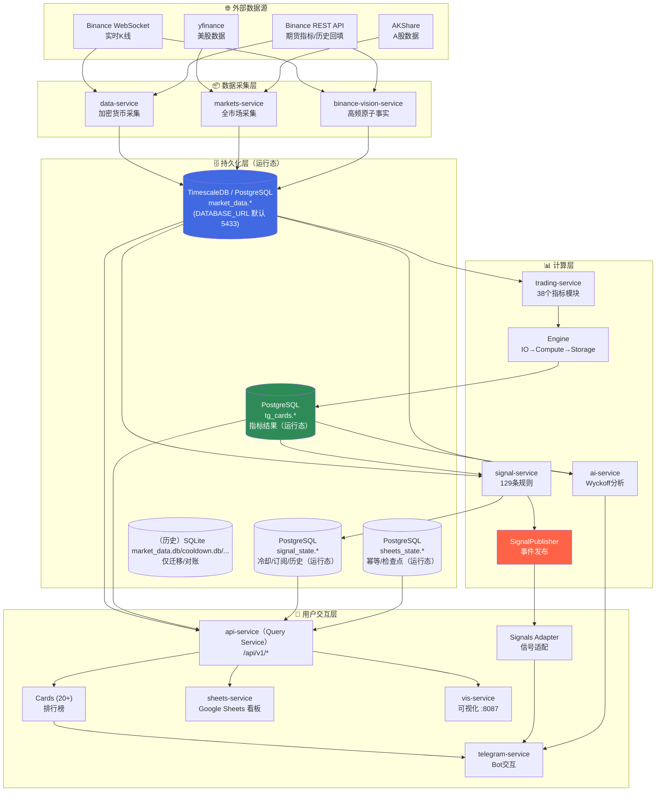
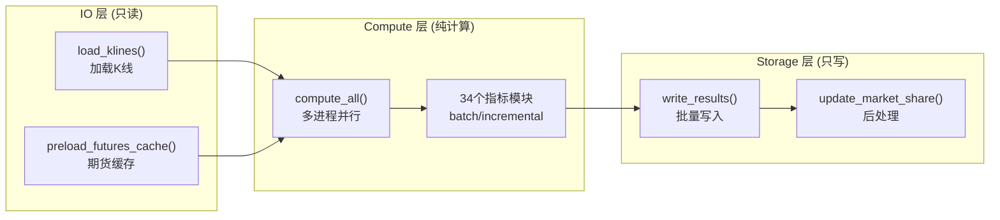
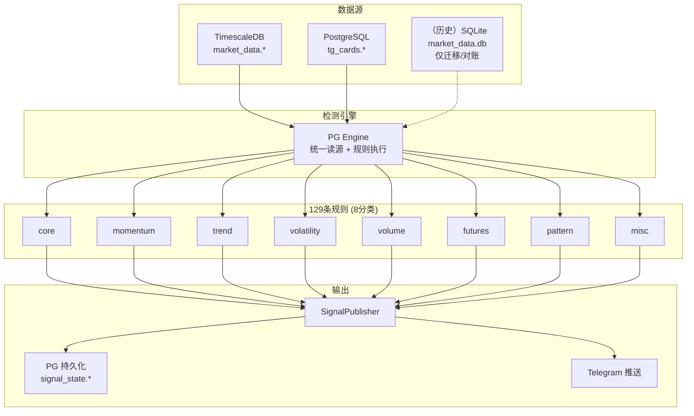

# TradeCat 项目整体架构分析报告

> 生成时间: 2026-01-29  
> 分析范围: 14个微服务、核心数据流、存储架构

---

## 0. 更新说明（2026-03）

- 运行态指标/状态已收敛到 PostgreSQL（`tg_cards.*` / `signal_state.*` / `sheets_state.*`），不再依赖 SQLite。
- 消费层（Telegram/Sheets/Vis）统一通过 Query Service（`services/consumption/api-service`, `/api/v1/*`）读取，禁止直连表名与底层实现细节。
- 文档中出现的 `market_data.db` / `cooldown.db` / `signal_history.db` 等 SQLite 内容仅用于**历史复盘/迁移对账**，已用“（历史）”标注。

## 1. 系统概览

TradeCat 是一个加密货币数据分析与交易辅助平台，采用微服务架构，核心功能包括：
- 多市场数据采集（加密货币、美股、A股、宏观经济）
- 34个技术指标计算
- 129条信号检测规则
- Telegram Bot 交互界面
- AI 智能分析（Wyckoff 方法论）

### 1.1 技术栈

| 层级 | 技术选型 |
|:---|:---|
| 语言 | Python 3.12, Node.js, Go |
| 数据库 | TimescaleDB (PostgreSQL 16) + PostgreSQL（运行态：`tg_cards/signal_state/sheets_state`；只读为主）；SQLite（历史/迁移对账） |
| 消息/事件 | SignalPublisher (内存事件总线) |
| API | FastAPI, python-telegram-bot |
| 数据处理 | pandas, numpy, TA-Lib |
| 外部数据 | CCXT, Cryptofeed, AKShare, yfinance |

---

## 2. 核心业务流程图

### 2.1 主数据流架构



### 2.2 指标计算流程（trading-service 内部）



### 2.3 信号检测流程（signal-service 内部）



---

## 3. 服务清单与职责边界

### 3.1 分层服务 (services/{ingestion,compute,consumption}/)

| 层 | 服务 | 位置 | 入口 | 职责 | 数据依赖 | 数据输出 |
|:---|:---|:---|:---|:---|:---|:---|
| ingestion | **binance-vision-service** | `services/ingestion/binance-vision-service` | `src/__main__.py` | Binance Vision Raw 对齐采集（ccxtpro WS/REST + Vision ZIP 回填） | Binance API / Binance Vision | TimescaleDB |
| compute | **trading-service** | `services/compute/trading-service` | `src/__main__.py` | 技术指标计算 | TimescaleDB | PostgreSQL（`tg_cards.*`） |
| compute | **signal-service** | `services/compute/signal-service` | `src/__main__.py` | 信号规则检测 | TimescaleDB + PostgreSQL（`tg_cards.*`/`signal_state.*`） | SignalPublisher + PostgreSQL（`signal_state.*`） |
| compute | **ai-service** | `services/compute/ai-service` | `src/__main__.py` | AI 分析（telegram 子模块） | TimescaleDB + PostgreSQL（`tg_cards.*`） | Telegram |
| consumption | **telegram-service** | `services/consumption/telegram-service` | `src/__main__.py` | Bot交互、排行榜展示、信号推送UI | Query Service（`/api/v1/*`）+ SignalPublisher | Telegram |
| consumption | **api-service** | `services/consumption/api-service` | `src/__main__.py` | Query Service：稳定数据契约（/api/v1；遮蔽底层表与实现） | PostgreSQL/TimescaleDB（只读） | HTTP |

> 注：`services/ingestion/data-service/` 为低频/分时兼容链路（1m K线、5m 指标），默认不进入顶层启动/校验链路，需要时手动运行。

> 说明：历史 `services-preview/*` 概念已从本仓库目录移除；如需预览服务，请在独立仓库/分支维护。

---

## 4. 数据存储架构

### 4.1 TimescaleDB / PostgreSQL（market_data.*）

> 端口以 `assets/config/.env.example` 为准：LF=5433（`DATABASE_URL`），HF=15432（`BINANCE_VISION_DATABASE_URL`）。

| 表名 | 数据量 | 说明 |
|:---|:---|:---|
| `market_data.candles_1m` | 3.73亿条 (99GB) | 1分钟K线 |
| `market_data.binance_futures_metrics_5m` | 9457万条 (5GB) | 期货指标 |
| `market_data.*_last` | 物化视图 | 各周期最新数据 |

> 注：本文档中的历史端口/拓扑描述以 2026-01 生成时为准；现行以 `.env.example` 与各服务 `Makefile/scripts` 为准。

### 4.2 PostgreSQL（运行态派生/状态）

| schema | 内容 | 主要写入者 | 主要读取者 |
|:---|:---|:---|:---|
| `tg_cards.*` | 指标/卡片派生结果（38 张表，对齐 SQLite 口径） | trading-service | api-service（Query Service）、telegram-service、ai-service、sheets-service、vis-service |
| `signal_state.*` | 冷却/订阅/历史（运行态状态） | signal-service | telegram-service、api-service |
| `sheets_state.*` | 幂等 keys / 检查点 / outbox（运行态状态） | sheets-service | sheets-service、api-service |

### 4.3 （历史）SQLite 快照（仅迁移/对账）

| 路径 | 用途 | 状态 |
|:---|:---|:---|
| `assets/database/services/telegram-service/market_data.db` | 历史指标库样本（schema 提取/迁移对账/回放） | 已废弃（只读） |

---

## 5. 模块边界约束

根据 AGENTS.md 定义的边界规则：

| 服务 | 允许 | 禁止 |
|:---|:---|:---|
| data-service | 数据采集、存储到 TimescaleDB | 计算指标 |
| trading-service | 指标计算、写入 PostgreSQL（`tg_cards.*`） | 直接推送消息 |
| telegram-service | Bot交互、信号推送 UI | 包含信号检测逻辑 |
| signal-service | 信号检测、规则引擎、写入 `signal_state.*` | Telegram 依赖、跨层写入 |
| api-service | REST API数据查询 | 写入数据库 |
| vis-service | 可视化渲染 | 写入数据库 |

---

## 6. 关键技术决策

### 6.1 计算引擎分层 (trading-service)

采用 IO/Compute/Storage 三层分离架构：
- **IO层**: 只读，负责从 TimescaleDB 加载K线数据
- **Compute层**: 纯计算，多进程并行，不做数据库读写
- **Storage层**: 只写，批量写入 PostgreSQL（`tg_cards.*`）

### 6.2 信号检测双引擎 (signal-service)

- **PG Engine（单一引擎）**：统一读取 `market_data.*`（K线/期货）与 `tg_cards.*`（指标派生），并将运行态状态写入 `signal_state.*`。

### 6.3 事件驱动通信

- 使用 `SignalPublisher` 内存事件总线
- 支持多订阅者（Telegram推送、历史持久化）
- 冷却机制防止重复推送

---

## 7. 附录

### 7.1 服务启动命令

```bash
# 核心服务一键启动
./scripts/start.sh start

# 单服务管理
cd services/<layer>/<name> && make start|stop|status

# 守护进程模式
./scripts/start.sh daemon
```

### 7.2 数据流验证命令

```bash
# 检查 TimescaleDB
PGPASSWORD=postgres psql -h localhost -p 5434 -U postgres -d market_data \
  -c "SELECT COUNT(*) FROM market_data.candles_1m"

# 检查 SQLite
sqlite3 assets/database/services/telegram-service/market_data.db ".tables"
```
