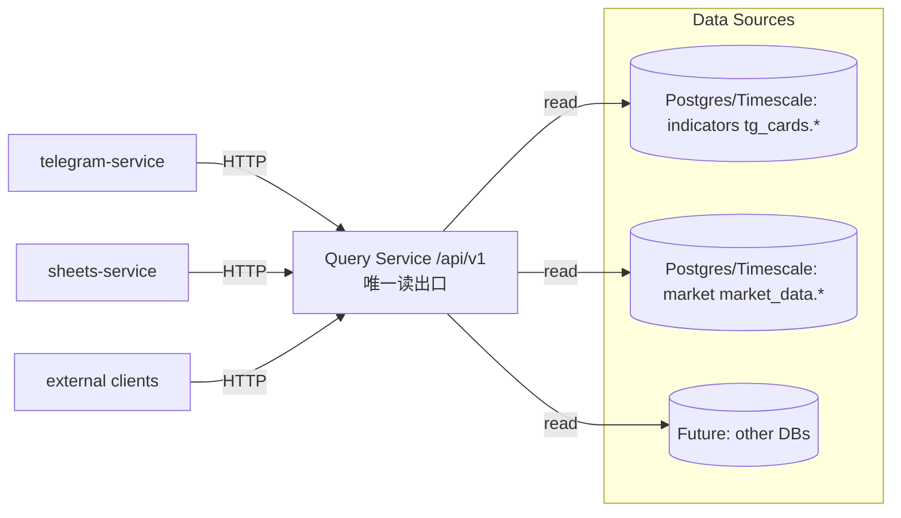

# PLAN（方案、路径与回滚）

## 1) 方案对比（至少两种）

### 方案 A：复用并升级现有 `api-service` 为 Query Service（推荐）

**核心思路**：把 `services/consumption/api-service` 明确为“只读 Query Service（/api/v1）”，消费端（TG/Sheets）一律 HTTP 调用；从仓库中删除直连 PG 的消费端实现与回退逻辑。

Pros：
- 最少新增基础设施（不新建第二套服务骨架/部署脚本/连接池）
- 复用现有 FastAPI/Makefile/测试框架
- 容易做“契约化/版本化”与可观测

Cons：
- 需要清理现有路由的历史耦合（例如 indicator router 动态 import TG provider）

### 方案 B：新建 `services/consumption/query-service`（不推荐）

**核心思路**：独立新服务，api-service 保留旧职责或逐步废弃。

Pros：
- 代码更干净，边界更清晰

Cons：
- 运维成本增加（第二套启动/监控/端口/脚本）
- 迁移期更复杂（两套 API 并存更久）

**选择**：采用 **方案 A**。

---

## 2) 目标数据流（Mermaid）

---

## 3) 原子变更清单（文件级，执行 Agent 用）

> 注意：本任务新增硬约束为“只保留新逻辑”。因此清单中所有 “旧直连/旧回退” 都必须删除，而不是保留为 fallback。

### 3.1 Query Service（复用 api-service）

- 新增：`services/consumption/api-service/src/routers/query_v1.py`
  - `/api/v1/health`
  - `/api/v1/dashboard`
  - `/api/v1/symbol/{symbol}/snapshot`
- 新增：`services/consumption/api-service/src/query/`
  - `datasources.py`：多 DSN 注册表（indicators/market/other）
  - `time.py`：UTC 解析 + 输出 `ts_utc/ts_ms/ts_shanghai`
  - `filters.py`：有效行过滤（占位/空行/指标特例）
  - `dao.py`：只读 SQL（禁止写入）
  - `service.py`：聚合组装（dashboard/snapshot）
  - `models.py`：Pydantic 响应模型（契约）
- 修改：`services/consumption/api-service/src/app.py`
  - 注册 `/api/v1` router
- 修改：`services/consumption/api-service/src/routers/indicator.py`
  - 删除动态 import telegram-service 的 `_ensure_telegram_imports/_get_snapshot_provider` 路径
  - 旧 `/api/indicator/snapshot` 如需保留：内部直接调用 `query.service`（不再触碰 TG 代码）

### 3.2 telegram-service（只允许 HTTP）

- 重写：`services/consumption/telegram-service/src/cards/data_provider.py`
  - 删除：`_PgPool`、`PgRankingDataProvider`、所有 `psycopg/sql` 查询
  - 新增：`QueryServiceClient`（httpx）+ `HttpRankingDataProvider`
  - `get_latest_data_time()` 由 HTTP 响应 `ts_utc` 驱动更新（供 Sheets exporter 复用）
- 修改：`services/consumption/telegram-service/src/cards/排行榜服务.py`
  - 删除所有 “provider 失败回退旧 handler 计算” 的路径（只保留 provider）
- 修改：`services/consumption/telegram-service/src/bot/env_manager.py`
  - 移除 `DATABASE_URL` 的只读/必填语义；新增 `QUERY_SERVICE_BASE_URL`（只读/必填）
- 修改依赖：
  - `services/consumption/telegram-service/requirements*.txt`：移除 `psycopg*`

### 3.3 sheets-service（只允许 HTTP + Sheets API）

- 修改：`services/consumption/sheets-service/src/idempotency.py`
  - 删除 `PgIdempotencyStore`
  - 新增 `SheetsIdempotencyStore`：
    - 推荐：工作簿隐藏 tab（例如 `__state__`）保存 `card_key` 列（追加写）
    - 或：DeveloperMetadata（容量更小，需评估上限）
- 修改：`services/consumption/sheets-service/src/tg_cards_exporter.py`
  - 不再依赖 PG 的“最新数据时间”；改为从 Query Service 响应驱动（通过 data_provider 的 latest 更新）
- 修改依赖：
  - `services/consumption/sheets-service/requirements*.txt`：移除 `psycopg*`

### 3.4 门禁 enforce（CI/verify）

- 修改：`scripts/verify.sh`
  - 新增扫描：除 `services/consumption/api-service/src` 外，`services/consumption/**/src` 禁止：
    - `psycopg` / `psycopg_pool`
    - 显式 SQL 片段：`(from|join|into|update)\s+(tg_cards|market_data).`

### 3.5 配置与文档

- 修改：`assets/config/.env.example`
  - 新增：`QUERY_SERVICE_BASE_URL`、`QUERY_SERVICE_TOKEN`（消费端）
  - 新增：多 DSN（Query Service 内部）：`QUERY_PG_INDICATORS_URL`、`QUERY_PG_MARKET_URL`、`QUERY_PG_OTHER_URL`（可选）
- 更新 READMEs：
  - `services/consumption/telegram-service/README.md`：数据源从 `DATABASE_URL` 改为 Query Service
  - `services/consumption/sheets-service/README.md`：同上 + 幂等存储迁移说明
  - `services/consumption/api-service/README.md`（如存在）：明确其为 Query Service

---

## 4) 回滚协议（必须可执行）

> 因为本任务“不保留 fallback”，回滚策略必须依赖版本控制，而不是运行时开关。

1) 若 Query Service 契约/性能问题导致大面积不可用：
   - `git revert` 回滚本任务相关 commits（按提交顺序回滚：门禁 → sheets → telegram → api-service）
2) 回滚后恢复旧直连（仅作为临时止血）：
   - 重新引入 `psycopg` 依赖并恢复旧 provider（由 revert 自动完成）
3) 复盘后再重新推进：
   - 优先补齐 Query Service 的可观测与稳定性（超时、缓存、慢查询限制）
