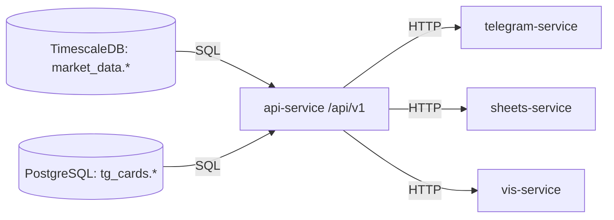

# PLAN - 任务决策与路径

## 方案对比（Pros/Cons）

### 方案 1：funding-rate 先止血为 not_supported（推荐）

**Pros**
- 立刻消除“错误数据污染”（正确性优先）。
- 不依赖上游采集链路与 DB schema 变更。

**Cons**
- 短期功能缺失（需要消费端/前端展示容错）。

### 方案 2：继续返回现有列但更名为“多空比”（不推荐）

**Pros**
- 表面上“有数据可用”。

**Cons**
- 本质仍是对外契约语义漂移（未来所有复盘会被误导）。
- 需要同步修改所有消费端文案与字段映射，且仍容易被误用。

结论：选择 **方案 1**，并在 PLAN 中为“接入真实 funding rate”留出清晰扩展点（另立任务或作为后续 P1）。

---

### 错误语义收敛：HTTP 状态码策略二选一

**A) 全部 HTTP 200，靠 body `success/code/msg` 表达错误（偏 CoinGlass 风格，最小破坏）**
- Pros：与现有 `api_response/error_response` 兼容；消费端改动最小。
- Cons：对标准 HTTP 客户端不友好；网关/监控需按 body 判错。

**B) 使用标准 HTTP status，并保留 body code（更工程化）**
- Pros：对网关/监控/重试语义更清晰。
- Cons：需要更大范围改动（现有大量端点默认 200），回归风险更高。

结论（默认）：选择 **A**（最少修改原则），把 validation/general exception handler 也收敛到 200；并在文档明确“错误率以 success=false 统计”。

---

### 数值精度策略：Decimal/NUMERIC 输出口径

**A) Decimal 统一输出字符串（最正确）**
- Pros：不丢精度；避免科学计数法漂移。
- Cons：消费端需要显式解析；可能引发契约类型变更。

**B) Decimal 输出 float（现状）但量化到固定精度（兼容优先）**
- Pros：更接近现有消费侧预期。
- Cons：仍不可逆丢精度；“稳定但不正确”。

结论：分阶段推进
- P0：修复 futures 路由的 `float→str(float)`（保持 string 输出但避免漂移）。
- P1：对 `/api/v1/*` 的 Decimal 输出做“兼容模式”演进（例如提供 `numeric_mode` 参数，默认保持现状，灰度切到 string）。

## 数据流/控制流（ASCII/mermaid）

## 原子变更清单（文件级步骤，不写代码）

### api-service（Query Service）

1) `services/consumption/api-service/src/routers/funding_rate.py`
   - 将 funding-rate 历史端点改为 `not_supported`（或检测真实数据源存在时走真数据）。
2) `services/consumption/api-service/src/app.py`
   - CORS：引入 `API_CORS_ALLOW_ORIGINS` allowlist；禁止 `* + credentials`。
   - 全局异常：对外返回通用错误，不回显 `str(exc)`；细节打日志（trace_id）。
   - （按选型）把 validation/general exception 的 HTTP status 收敛到一致策略。
3) `services/consumption/api-service/src/routers/query_v1.py`
   - 鉴权：新增 `QUERY_SERVICE_AUTH_MODE`，默认 required；无 token -> unauthorized。
   - 资源上限：对 dashboard/snapshot 的 cards/intervals/symbols/limit 做硬限制。
4) `services/consumption/api-service/src/query/datasources.py`
   - DSN 脱敏：支持 URL 与 key=value DSN；未识别格式时不回显原文。
   - sources 探测失败：error 文案脱敏（避免包含 DSN/SQL/host）。
5) `services/consumption/api-service/src/routers/ohlc.py`
   - `startTime/endTime` 改为 `is not None` 判断（允许 0）。
6) `services/consumption/api-service/src/routers/open_interest.py`
   - `startTime/endTime` 修复同上；避免 float→str(float) 漂移（保留 Decimal）。
7) `services/consumption/api-service/src/query/dao.py`
   - Decimal 处理按“分阶段精度策略”落地（P1）；补齐单测覆盖。
8) `assets/config/.env.example`
   - 新增/更新：`QUERY_SERVICE_AUTH_MODE`、`API_CORS_ALLOW_ORIGINS`、（可选）`QUERY_NUMERIC_MODE` 等。

### telegram-service（消费端抗抖动）

1) `services/consumption/telegram-service/src/cards/data_provider.py`
   - QueryServiceClient：缓存加锁；增加指数退避重试；失败时 stale-if-error 返回缓存（可观测标记）。

### trading-service（compute 指标可靠性）

1) `services/compute/trading-service/src/indicators/batch/futures_gap_monitor.py`
   - 缓存更新加锁；异常不再静默吞掉，输出显式 error/信号，日志可观测。

## 回滚协议（自愈步骤）

1) 若 v1 鉴权切 fail-closed 导致消费端全挂：
   - 临时设置 `QUERY_SERVICE_AUTH_MODE=disabled` 恢复访问（仅用于止血，必须记录）。
   - 逐个修复消费端携带 token 后再切回 required。
2) 若 dashboard 上限误伤：
   - 提高上限阈值或临时关闭上限（通过 env 开关），并记录真实请求规模。
3) 若 Decimal 策略导致展示异常：
   - 保持默认兼容模式（不切换到 string）；先让消费端同时支持两种类型再灰度切换。
4) 最终回滚：
   - 以单 PR/单提交拆分变更，确保可 `git revert <sha>` 无冲突回退。

