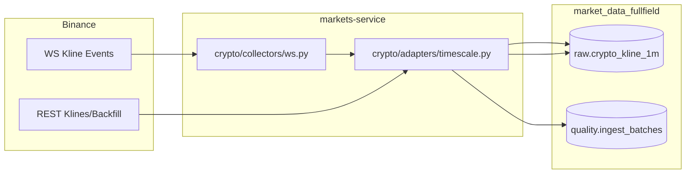

# PLAN - 架构决策与落地路径

## 目标

用“新库隔离 + 单币种最小闭环”验证 raw 模式采集的正确性与字段完整性，避免在大规模采集前把成本/风险放大。

## 方案对比（至少两个）

### 方案 A（推荐）：复用 `markets-service` + 新建数据库

**做法**：创建新 DB（`market_data_fullfield`），对其执行 `services-preview/markets-service/scripts/ddl/*.sql`，然后用 `markets-service` 的 `crypto-ws` 在 raw 模式跑单币种。

- Pros
  - 复用现成采集实现：WSCollector 已产出 `quote_volume/trade_count/taker_buy_*`（`services-preview/markets-service/src/crypto/collectors/ws.py#L90-L98`）
  - DDL 已具备：`services-preview/markets-service/scripts/ddl/03_raw_crypto.sql`、`08_quality.sql` 等
  - 变更面主要是“运维命令与配置注入”，代码改动可为 0（若本地代理 9910 可用）
- Cons
  - 当前实现强制代理到 `127.0.0.1:9910`（`services-preview/markets-service/src/crypto/config.py#L28-L32`），在无代理环境会阻断启动，可能需要做一次小修

### 方案 B：新建一个最小“单币种采集服务”（新微服务目录）

**做法**：创建 `services-preview/single-ingest-service`，复用 `psycopg/ccxt` 直接抓取 Binance Kline（REST 或 WS）并写入一张新表（含 JSONB raw payload）。

- Pros
  - “全字段”定义可扩展到 raw JSON 100% 落盘（最强证据链）
  - 可彻底摆脱 `markets-service` 当前强制代理逻辑
- Cons
  - 新增服务意味着：目录、启动脚本、依赖、文档同步的工作量更大
  - 更易越界为“重构/造轮子”

**选择**：优先方案 A。若遇到代理强制导致不可运行，再在方案 A 上做最小补丁（让代理可配置/可关闭），仍然不引入新服务。

## 逻辑流图（Mermaid）

## 原子变更清单（文件/操作级序列，不写代码）

1. **DB 层（新库）**
   - 创建数据库：`market_data_fullfield`
   - 依序执行 DDL：`services-preview/markets-service/scripts/ddl/01_*.sql` → `09_*.sql`
2. **运行层（单币种）**
   - 以 env 注入方式启动 `markets-service`：
     - `MARKETS_SERVICE_DATABASE_URL=.../market_data_fullfield`
     - `CRYPTO_WRITE_MODE=raw`
     - `SYMBOLS_GROUPS=one`、`SYMBOLS_GROUP_one=BTCUSDT`
   - 启动 `python -m src crypto-ws`
3. **数据完整性**
   - 若 WS 字段不全：执行一次 `python -m src crypto-backfill --klines --days 2`（限定单币种）
4. **验收**
   - 严格按 `ACCEPTANCE.md` 的 SQL 断言验证

## 回滚协议（100% 还原现场）

1. 停止采集进程（记录 PID 与日志路径）
2. 删除新库（仅当确认是实验库）：`DROP DATABASE market_data_fullfield;`
3. 清理仅用于本任务的临时环境变量/临时脚本（如果有）
4. 若对 `markets-service` 做了“代理可配置”类修复：
   - 回滚该 commit / 恢复原逻辑
   - 重新跑 `crypto-test` 确认回到原状态

