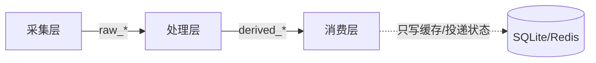

# PLAN - 架构决策与路径（维度治理）

## 1) 方案对比（至少两个可选方案）

### 方案 A：第三方架构/依赖检查器（如 import-linter 等）

Pros:
- 现成能力丰富，规则表达力强
- 输出与生态成熟

Cons:
- 需要新增依赖（与“禁止添加未经验证依赖”冲突风险大）
- 在多服务/多运行时场景里，落地与维护成本不可控

### 方案 B：自研最小门禁（基于现有工具链：Python + grep/find）

Pros:
- 0 新依赖，落地快，可按项目语义定制
- 输出可控，易做“可读失败信息”

Cons:
- 规则表达力需要逐步完善
- 初期覆盖面有限，需要迭代

**选择**：方案 B（先保证可执行与可回滚，再逐步演进规则强度）。

---

## 2) 关键数据流与治理闭环

### 2.1 三层单向数据流（治理对象）

### 2.2 治理闭环（让系统“越来越不容易烂”）

---

## 3) 原子变更清单（精确到文件级别，不写代码只写动作）

> 执行 Agent 按此清单落地；本任务只负责把清单写到可执行、可验收。

### 3.1 文档层（规范成为真相源）

1. 固化并版本化：
   - `docs/architecture/CONSTITUTION.md`（v1）
   - `docs/analysis/layer_contract_one_pager.md`（v1）
   - `docs/analysis/repo_structure_design.md`（v1）
2. 新增 `docs/architecture/` 下的“门禁清单”文档（列出每条 MUST 对应的检查项与失败输出格式）。

### 3.2 门禁层（把 MUST 变成脚本）

1. 新增 `scripts/` 下的门禁脚本（示例命名）：
   - `scripts/check_dependency_boundaries.py`
   - `scripts/check_contract_changes.py`
   - `scripts/check_idempotency_keys.py`
   - `scripts/check_time_semantics.py`
   - `scripts/check_observability_minimum.py`
2. 将门禁接入：
   - 本地：`./scripts/verify.sh` 或 `make verify`（按仓库现状选择最小侵入点）
   - CI：`.github/workflows/ci.yml`（确保 PR 早失败）

### 3.3 适配 Agent-Coding（降低上下文窗口压力）

1. 为每个核心边界补“局部可读入口”：
   - 每层一个短 README（说明输入/输出/写点/幂等键/时间锚点）
2. 为每条门禁提供“最小修复指南”（让 Agent 不需要读全仓库也能修）。

---

## 4) 失败输出规范（门禁必须“像编译器一样”报错）

门禁失败输出必须包含：

- 违反条款号（对应宪法 MUST 编号）
- 违规文件路径
- 违规原因（可读中文）
- 最小修复建议（1-2 行）
- 如允许豁免：豁免开关名称 + 必须记录的位置

---

## 5) 回滚协议（100% 还原现场）

> 门禁是“治理工具”，不是“绑架工具”。必须可回滚，避免停摆。

1. CI 回滚：允许通过环境变量临时关闭单项门禁（例如 `GATE_DISABLE_DEP_BOUNDARY=1`），但必须：
   - 在 `STATUS.md` 记录原因与恢复时间点
   - 下一次发布前必须恢复
2. 脚本回滚：门禁脚本每次升级必须保留上一版 tag/文件备份（或 git revert 指令）。
3. 文档回滚：宪法/契约版本化输出；破坏性变更必须保留旧版至少一个弃用周期。

